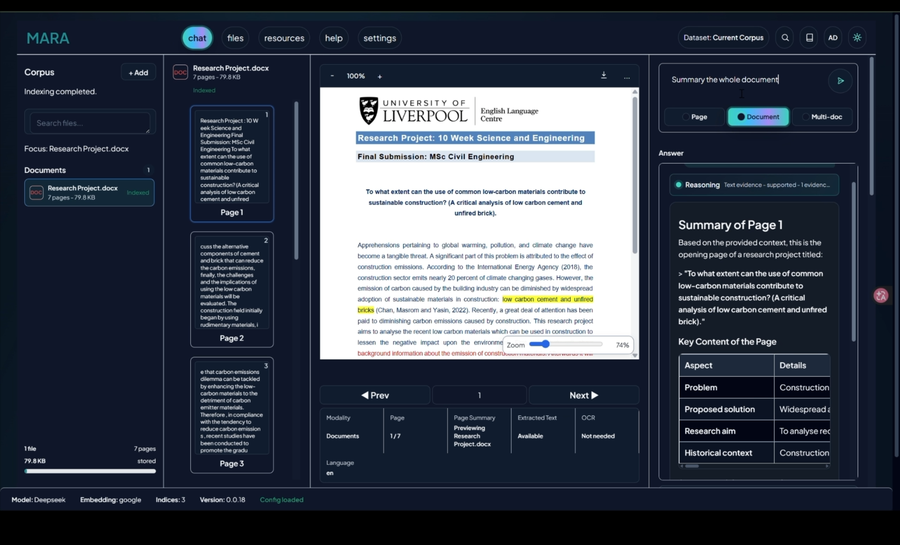
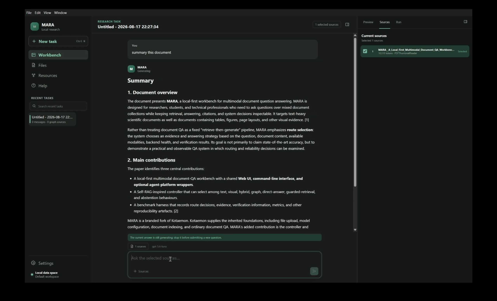

# MARA

**Multimodal Agentic Retrieval and Answering**

A document research workbench for asking questions about your own sources,
inspecting the supporting evidence, and turning findings into notes and study
materials.

[中文说明](README.zh-CN.md) ·
[Install](#install-web-and-cli) ·
[Web](#use-the-web-workbench) ·
[CLI](#use-the-cli) ·
[Desktop](#use-mara-desktop-preview) ·
[Research and limitations](#research-and-expected-results)

MARA builds on [Kotaemon](https://github.com/Cinnamon/kotaemon). It adds an
application layer that connects question requirements, retrieval routes,
evidence identities, verification, and recovery, together with shared document
QA services for the browser and command line. It uses existing language models
and retrieval backends; you configure the models that perform inference.

## What can I do with MARA?

- Read a paper, report, manual, or slide deck and ask questions about the whole
  document, a page, a selected passage, or several documents.
- Inspect retrieved passages and citations alongside the document preview.
- Explore relationships through a knowledge graph and use a selected node as
  context for a follow-up question.
- Save sources, answers, and research notes in a conversation.
- Generate a study guide, quiz, flashcards, a briefing, a comparison table, or
  other Studio artifacts, then export the supported formats.
- Run document QA from scripts, or use the separate slide/workspace commands to
  inspect, review, and work with presentations.

**Local-first describes storage, not an automatic offline mode.** Source files,
indexes, and conversation data can stay on your machine. A remote model or
document-processing service may receive your question, retrieved content,
conversation context, or page images. A fully local workflow also requires local
inference and parsing backends, with their models and resources available.

The default file collection accepts PDF; Word (`.doc`, `.docx`); Excel (`.xls`,
`.xlsx`); PowerPoint (`.ppt`, `.pptx`); CSV; HTML/MHTML; text and Markdown;
PNG/JPEG/TIFF images; and ZIP archives. Accepted extensions describe the input
surface. Successful extraction still depends on the document and reader setup.

## Choose your interface

| Interface | Best for | Current scope |
| --- | --- | --- |
| **Web workbench** | Reading documents, checking evidence, graph exploration, notes, and Studio | The broadest interactive workflow; runs locally in your browser through Gradio. |
| **MARA CLI** | Repeatable questions, batch workflows, structured output, and slide tools | `MARA docqa` uses shared document QA services. `MARA` and `MARA-cli` expose the same public commands. |
| **MARA Desktop** | A native window, file import, background indexing, and conversation tasks | Windows/Linux **testing preview**. It does not yet cover every Web feature. |

Codex and Claude Code integrations are optional ways to invoke these commands,
described [below](#codex-and-claude-code). They are separate from the three
application interfaces.

| Operating system | Web and CLI from source | Desktop distribution |
| --- | --- | --- |
| Windows | PowerShell installer; Python 3.10 | Windows x64 preview archive |
| Linux | Bash installer; Python 3.10 | Linux x64 preview, built for Ubuntu 22.04; see the release's tested systems |
| macOS | Bash installer is provided; native parsing dependencies need a compatible local setup | No macOS desktop package is documented or provided by the current packaging scripts |

## Install Web and CLI

### 1. Prepare the tools

Install [Git](https://git-scm.com/downloads), a local **Python 3.10** interpreter,
and **uv 0.11.19**, the version required by this checkout's
[pyproject.toml](pyproject.toml).

The installers expect Python to be installed already and disable automatic
Python downloads. For example, with Python available:

```shell
python -m pip install "uv==0.11.19"
uv --version
uv python find 3.10
```

On Windows, use `py -3.10 -m pip` if `python` does not select Python 3.10.
On macOS/Linux, the interpreter may be named `python3.10`.

The first install downloads the locked runtime dependencies and can take time.
A local GPU is not required when using remote inference. Local models have their
own RAM/VRAM requirements.

The Python distribution that provides the commands is named
`mara-research-cli`. On **2026-09-10**, its public PyPI and TestPyPI metadata
endpoints returned 404. Use the source installation below instead of relying
on a package-index installation.

### 2. Clone and configure

```shell
git clone https://github.com/262412/MARA.git
cd MARA
```

Create a repository-root `.env` from [.env.example](.env.example):

Windows PowerShell:

```powershell
Copy-Item .env.example .env
```

macOS/Linux:

```bash
cp .env.example .env
```

Edit `.env` **before the first runtime check or launch**. For a basic setup you
need both a chat model and an embedding model. Chat produces answers; embeddings
make documents searchable.

For an OpenAI-compatible service that supports **both** endpoints, the minimal
configuration has this shape:

```dotenv
OPENAI_API_BASE=https://api.openai.com/v1
OPENAI_API_KEY=YOUR_API_KEY
OPENAI_CHAT_MODEL=YOUR_CHAT_MODEL_ID
OPENAI_EMBEDDINGS_MODEL=YOUR_EMBEDDING_MODEL_ID
```

Replace the placeholders with model IDs available to your account. Blank unused
provider keys in the copied example. A chat-only endpoint cannot serve as an
embedding endpoint; configure a separate embedding provider under **resources**
in that case.

For local inference, configure an available local service, such as Ollama, and
set the model names it actually hosts:

```dotenv
LOCAL_MODEL=YOUR_LOCAL_CHAT_MODEL
LOCAL_MODEL_EMBEDDINGS=YOUR_LOCAL_EMBEDDING_MODEL
KH_OLLAMA_URL=http://localhost:11434/v1/
```

Select the intended default **LLM** and **Embedding** in the Web resources panel.
Setting a model name does not download or start that model.

### 3. Install the locked runtime

Run the installer from the primary checkout.

Windows PowerShell:

```powershell
.\install.ps1
.\.venv\Scripts\Activate.ps1
MARA app run --host 127.0.0.1
```

macOS/Linux:

```bash
chmod +x install.sh
./install.sh
source .venv/bin/activate
MARA app run --host 127.0.0.1
```

The scripts install the local workspace packages with the committed lockfile,
include the CLI, initialize user configuration, and run `MARA app doctor`.
If a step fails, address that error before launching. They do not install
external models or operating-system document tools.

Open the URL printed by MARA, normally
[http://127.0.0.1:7860](http://127.0.0.1:7860). Stop the server with
`Ctrl+C`. Use another port when needed:

```shell
MARA app run --host 127.0.0.1 --port 7870 --no-browser
```

Port selection uses `--port`, then `GRADIO_SERVER_PORT`, then deployment `PORT`,
with 7860 as the default.

Without activating the environment, use `.venv\Scripts\MARA.exe` on Windows or
`.venv/bin/MARA` on macOS/Linux.

For updates, update the checkout and rerun its installer. Keep runtime data and
configuration backed up. Skip recreating existing user configuration with
`.\install.ps1 -SkipInit` on Windows or `SKIP_INIT=1 ./install.sh` on macOS/Linux.
Use the same option if initial setup reports that the user config already exists.
Routine commands should use the existing environment; do not resynchronize
workspace packages as editable installs.

### 4. Check what is ready

```shell
MARA --help
MARA-cli --help
MARA doctor
MARA app doctor
MARA docqa doctor
```

These checks report different things: command availability, agent/provider
configuration, application paths, and document QA readiness. `MARA app doctor`
can pass while warning that models are missing; `MARA docqa doctor` requires
configured default LLM and embedding entries and fails until they are available.
Successful indexing and a source-backed answer are the next checks.

Optional document capabilities need additional tools:

| Capability | Additional requirement |
| --- | --- |
| Office preview and conversion for Word, Excel, and PowerPoint | LibreOffice accessible to the runtime; conversion is strict by default |
| Scanned documents and image text | An OCR-capable reader and its configured dependencies, such as Tesseract |
| Visual question answering | Usable page-image evidence, a configured visual retriever where required, and a compatible vision generator |
| Audio/video artifacts | The renderer/backend and media tools required by that artifact; installing the CLI alone is insufficient |

Start with the included Markdown example before troubleshooting a more complex
file format. The optional container workflow is in
[Docker usage](docs/development/container-usage.md).

## Use the Web workbench



A real document-QA example: the indexed Word document and page navigation are
on the left, the source preview is in the center, and the answer is on the right.
See the [screenshot notes](docs/images/README.md) for the source and visible state.

<details>
<summary>First launch in an empty workspace</summary>


Actual startup capture from a separate empty workspace, before configuring
models or importing documents.

</details>

1. **Configure models.** Open **resources**, check the LLM and Embedding entries,
   and select valid defaults. Saved model settings may already exist.
2. **Import a source.** Open **files** or use the source panel's add/upload
   control. Upload [mara-quickstart.md](docs/examples/mara-quickstart.md), or a
   small document of your own. Wait for indexing to finish successfully.
3. **Choose the scope.** Select a source and **Document** for whole-document QA.
   Use **Page** with a selected page, or **Multi-doc** with several sources.
   Selected-text questions also require the intended passage.
4. **Ask a question.** For the example, ask:
   “How many reports are in the pilot, and how are they split by format?”
5. **Check the evidence.** The source states **12 reports: 8 PDFs and
   4 presentations**. Inspect the answer's references and source context.
   Exact wording varies with the model.
6. **Keep useful work.** Save an answer or note, generate a Studio artifact from
   the selected sources, or explore the knowledge graph and ask a follow-up.

The example is fictional demonstration material. Its expected answer comes from
the source text; it is not a reported benchmark result.

For page-based sources, citation review and preview help you check which passage
or page supports an answer. Evidence coverage, citation correctness, and answer
correctness still require inspection.

## Use the CLI

Run these commands with the installed environment active and the same runtime
configuration as your Web workspace.

### Import, ask, and resume

```shell
MARA docqa index docs/examples/mara-quickstart.md
MARA docqa files
MARA docqa ask --file mara-quickstart.md --prompt "How many reports are in the pilot, and how are they split by format?" --reasoning mara --route doc --citation inline
MARA docqa sessions
```

`index` accepts one or more paths. Check its reported failures, then confirm the
file appears in `files`. `ask --file` selects an **already indexed** file by ID
or name; it does not replace the import step. Prefer IDs when names are
ambiguous.

A normal text response includes the conversation ID, the answer, and available
evidence. MARA runs can also report routing, retrieval, verification, and
modality information. Add `--json` when consuming structured output.

Replace `CONVERSATION_ID` below with the returned ID:

```shell
MARA docqa ask --conversation CONVERSATION_ID --prompt "List the review stages."
MARA docqa resume CONVERSATION_ID
```

Use `MARA docqa chat` to start interactive QA. Its REPL includes `/files`,
`/use`, `/page`, `/selected-text`, `/history`, and `/exit`.

### Control the question scope

Index the example files in these commands first, then use their names or IDs:

```shell
MARA docqa ask --file report.pdf --page 3 --prompt "Explain the table on this page."
MARA docqa ask --file report.pdf --selected-text "operating margin" --prompt "Explain this passage."
MARA docqa ask --file report-a.pdf --file report-b.pdf --scope multi-document --prompt "Compare the stated assumptions." --reasoning mara --task compare
```

### Inspect routing and verification

The controller can choose among direct, text, visual, element, graph, and hybrid
paths, or abstain when the configured policy cannot obtain adequate support.
The available paths depend on your indexed evidence and backends.

```shell
MARA docqa ask --file mara-quickstart.md --prompt "Summarize the pilot and cite the source." --reasoning mara --controller llm --route auto --verify light --json
```

This explicitly enables controller planning and light verification.
The CLI defaults for `--controller` and `--verify` are **off**.
A route label alone does not prove that images reached a vision model, and
verification status does not guarantee factual correctness.
Use `MARA docqa ask --help` for model, route, context-length, and language options.

### Generate and export study materials

```shell
MARA docqa artifacts generate CONVERSATION_ID --type study_guide --file mara-quickstart.md --prompt "Create a short guide to the pilot."
MARA docqa artifacts list CONVERSATION_ID
MARA docqa artifacts export CONVERSATION_ID --artifact ARTIFACT_ID --format md --output study-guide.md
```

Replace both IDs with values from your session and artifact list. Other artifact
types include quizzes, flashcards, mind maps, slide outlines, briefing documents,
FAQs, timelines, custom reports, data tables, infographics, slide decks, and
audio/video overviews. Supported exports include Markdown, HTML, JSON, CSV, SVG,
PPTX, MP3, and MP4, **depending on the artifact type and installed dependencies**.

`MARA docqa sources` and `MARA docqa notes` manage the conversation's notebook
sources and notes. Inspect each command's `--help` for its arguments.

### Slide tools and model routing

Slide inspection is a separate workflow from document QA:

```shell
MARA inspect --file slides.pptx
MARA read-slide --file slides.pptx --slide 1
MARA extract --file slides.pptx
MARA review --file slides.pptx
MARA run --file slides.pptx --prompt "Rewrite the opening for executives." --dry-run
```

| Command | Purpose |
| --- | --- |
| `MARA inspect`, `MARA read-slide` | Inspect a deck or one slide |
| `MARA extract`, `MARA search`, `MARA review` | Extract text, search deck content, or run a deterministic review |
| `MARA files`, `MARA read` | List workspace files or read a text file |
| `MARA write`, `MARA delete`, `MARA shell` | Write/delete workspace files or execute a shell command |

The top-level `run`, `chat`, `sessions`, and `resume` commands manage deck-agent
workflows. `apply` and `export-pdf` handle deck output.
`files`, `read`, `write`, `delete`, and `shell` operate on workspace files.
In particular, `MARA docqa delete` removes indexed sources; it is not the same as
deleting a saved conversation or using `MARA delete`.

The separate model-routing configuration can be inspected without changing the
Web model defaults:

```shell
MARA model init-config --output modelcli.yml
MARA model providers --config modelcli.yml
MARA model run --help
```

## Use MARA Desktop (preview)



The native workbench shows recent tasks on the left, a document summary in the
center, and the selected source on the right. This capture shows the answer
while it is still generating.

Desktop uses Electron and React with a bundled Python service. Current source
includes native file import, background indexing, file management, conversation
creation/search/rename/delete, document and multi-document questions, streamed
answers, cancellation, and retry.

Page/selected-text scope, citation navigation and preview, Notes, Studio,
complete resource/settings management, and data migration still have outstanding
work. See the [feature matrix](docs/desktop/feature-parity-matrix.md) for the
current evidence and acceptance status.

### Download a preview

The [indexing-readiness repair preview](https://github.com/262412/MARA/releases/tag/desktop-gate3-preview-4112e99)
provides Windows x64 and Linux x64 archives with `SHA256SUMS.txt`.
It is a pinned testing build; it may have fewer capabilities than current source.
Check [Releases](https://github.com/262412/MARA/releases) for newer, non-withdrawn
previews and their release notes.

1. Download the archive for your OS and the checksum file from the same release.
2. Verify the archive's SHA-256, then extract the **entire** archive.
3. On Windows, launch `MARA.exe` from the extracted application directory.
   On Linux, launch the extracted `MARA` executable.
4. Check runtime status and model settings before importing a small document.
   Configure chat and embeddings, import the file, wait for indexing, and start
   a conversation.
5. Check the answer and the task's completion status. Use Web for capabilities
   that the preview has not yet integrated.

Preview archives contain their runtime; users do not need to install Python or
Node.js to run them. Keep the executable and its companion resources together.
Windows 10/11 product acceptance for the linked build is still listed as pending
in its release notes. No stable desktop-installer or macOS-support claim is made.

### Run current Desktop source

First install the Python runtime above. Desktop development additionally
requires **Node.js 22.12 or later** and npm.

Windows PowerShell, from the repository root:

```powershell
$env:MARA_DESKTOP_PYTHON = (Resolve-Path .venv\Scripts\python.exe).Path
cd apps/desktop
npm ci
npm start
```

Linux, from the repository root:

```bash
export MARA_DESKTOP_PYTHON="$PWD/.venv/bin/python"
cd apps/desktop
npm ci
npm start
```

`npm start` builds the application and launches Electron.
[Desktop development](apps/desktop/README.md) covers contracts, testing, and
native packaging.

Desktop uses its own data root: normally `%APPDATA%/MARA` on Windows and
`$XDG_DATA_HOME/MARA` or `~/.local/share/MARA` on Linux.
Do not assume it automatically opens an existing Web/CLI database or that
simultaneous writes across interfaces are supported.

## Configuration and data

| Setting or location | Purpose |
| --- | --- |
| Repository `.env` and [flowsettings.py](flowsettings.py) | Source-workspace model defaults and application settings |
| `MARA app init` | Creates user-level configuration templates; `app doctor` reports the effective paths |
| User config `.env` / `flowsettings.py` | Packaged-runtime configuration when no workspace or explicit settings module takes precedence |
| `KH_APP_DATA_DIR` | Overrides the application's data directory |
| `modelcli.yml` | Separate provider/alias configuration for `MARA model` and agent workflows |
| Desktop Settings and its data directory | Desktop-owned model settings and application state |

Runtime discovery checks an explicit `THEFLOW_SETTINGS_MODULE`, then a workspace
`flowsettings.py`, then packaged defaults. Running from the repository and
running from another directory can therefore select different settings.
Use `MARA app doctor` to check **Settings source**, **App data dir**, and
**File storage** before expecting Web and CLI to share records.

Source mode defaults to `ktem_app_data/`. The packaged runtime retains the
platform-directory names **Cinnamon/Kotaemon** for compatibility; the command's
reported paths are authoritative.

Existing LLM and embedding records are persisted in the application database.
Editing `.env` supplies defaults but does **not** overwrite an existing saved
provider. Update the corresponding entry in **resources** and check its default
selection. Changing embedding models may require reindexing the documents.

Back up the complete data directory, including uploaded files, indexes, and
conversation/database state, with the application stopped. Keep credentials
outside Git.

### Network access and authentication

The local examples bind to `127.0.0.1`. Before deliberately serving on a network
interface, configure `MARA_AUTH_MODE=password` with a provisioned administrator,
or `MARA_AUTH_MODE=sso` with Google/Keycloak settings. Changing the bind address
alone does not provision authentication.

`MARA app init --help` documents password initialization for a new user
configuration. The initializer targets `KH_APP_DATA_DIR` when explicitly set,
otherwise the packaged data directory; match that directory to the one being
served. Reinitializing with `--force` recreates the user `.env` and
`flowsettings.py` and may reset an existing administrator, so back up and restore
the intended settings as part of a deliberate migration. The
[container guide](docs/development/container-usage.md) gives a complete
password-file and persistent-volume example.

## Codex and Claude Code

MARA supplies support bundles for both tools. These install MARA instructions
and skills; they do not install the host tool itself.
Focused skills include `MARA-docqa-ask`, `MARA-docqa-index`, and
`MARA-docqa-delete` for single questions, import, and indexed-source removal.

```shell
MARA platform list
MARA platform install --platform codex --mode full --dry-run
MARA platform install --platform codex --mode full --yes
MARA platform validate --platform codex --installed
```

For Claude Code, replace `codex` with `claude-code`. The default targets are
`~/.codex` and `~/.claude`; `--target-dir` selects another target.
[Platform support](docs/development/platform-cli-support.md) explains merge and
backup behavior.

The repository's [.codex](.codex) contains shared MARA support assets.
[.github](.github) provides automation and [.githooks](.githooks) protects the
shared development environment. Their leading dot does not make them caches.
See the [directory guide](docs/development/repository-directory-guide.md).

## Research and expected results

MARA's research contribution is the integration of explicit query requirements,
central route selection, canonical evidence identities, configurable
verification/recovery, and shared runtime services. The
[dissertation records](https://github.com/262412/MARA-dissertation-records)
describe the design and its evidence boundaries.

The revision consulted for this README was
[`38846af`](https://github.com/262412/MARA-dissertation-records/tree/38846af48bcec410d89150351a3d1e1541cd7bc3/dissertation).
It separates current implementation/regression evidence from a preserved
six-task evaluation covering FinanceBench, QASPER, RAGTruth, ALCE-ASQA, MMDocRAG,
and SlideVQA. Those are selected **local task adaptations**.

The recorded comparisons do not establish a general controller-quality
advantage. Some configurations abstain too often; answer overlap and evidence
quality can diverge. Missing raw records and unmatched live interface tasks also
limit reproduction and cross-interface claims. The README therefore does not
promise published-benchmark parity, guaranteed correct citations, or better
answers from every more complex route.

For a new installation, useful success criteria are concrete:

| Action | Expected result to inspect |
| --- | --- |
| Start the runtime | The UI opens; doctor reports the intended data paths and any missing model configuration |
| Import a small source | Indexing completes without reported failures and the file appears in the source list |
| Ask the quickstart question | The answer matches the source's 12 / 8 / 4 counts and offers inspectable source support |
| Continue a conversation | Its history and selected context can be recovered in the same runtime/user |
| Generate an artifact | A saved artifact can be listed, opened, and exported in a supported format |

These are acceptance targets for your configuration, not a claim that all models
and file formats have passed them. A successful process alone is insufficient.

The [benchmark framework](benchmark/README.md) contains evaluation commands and
artifact conventions. Inspect per-example predictions, citations, terminal
states, failures, and scoring provenance as well as aggregate metrics.

## Troubleshooting

| Symptom | Next check |
| --- | --- |
| `uv` rejects its version or cannot find Python | Use uv 0.11.19 and an existing Python 3.10 interpreter; installers do not download Python |
| `MARA` is not found after installation | Activate the correct environment or use its full executable path |
| UI opens but indexing fails | Verify the default embedding provider, endpoint, credentials, and selected reader |
| Editing `.env` has no effect | Check the effective settings source and saved model entries under resources |
| Web and CLI show different files | Compare runtime paths, user identity, selected sources, and conversation context |
| Office or scanned files fail | Check conversion/OCR dependencies; confirm a simple Markdown import works first |
| No supporting evidence or excessive abstention | Check selected sources, scope, retrieval results, backend availability, and verification mode |
| Desktop feature is missing | Check the preview's release notes and feature matrix; use the Web workbench for the wider feature set |
| The default port is occupied | Launch with `MARA app run --port 7870` |

## Repository and development

```text
apps/desktop/       Electron/React desktop application and Python adapter
libs/slide_cli/     MARA / MARA-cli command implementation
libs/ktem/          Web UI, document QA runtime, sessions, and application services
libs/kotaemon/      Retrieval, models, document processing, and platform bundles
benchmark/         Evaluation runners, adapters, and analysis
docs/              User, architecture, desktop, and development documentation
scripts/           Installation support, verification, packaging, and HPC tools
```

Internal package names preserve compatibility with the Kotaemon foundation.

For non-trivial changes, follow the
[codebase hygiene contract](docs/development/codebase-hygiene-contract.md) and
[storage/environment contract](docs/development/storage-layout-contract.md).
The latter includes the maintainers' HPC-specific layout.
Only the primary checkout owns the canonical environment; linked worktrees use
`scripts/run_with_canonical_env.sh`.

In a prepared primary development environment, run focused checks without
synchronizing dependencies:

```shell
uv run --no-sync --python 3.10 python scripts/check_codebase_hygiene.py path/to/changed.py
```

For CLI changes, run the package gate from `libs/slide_cli`:

```shell
uv run --no-sync --python 3.10 python -m pytest -q
```

Do not refresh the hygiene baseline to hide a failing check.
See [CONTRIBUTING.md](CONTRIBUTING.md) for contribution guidance.

## License and acknowledgements

MARA is distributed under [Apache License 2.0](LICENSE.txt).
[NOTICE](NOTICE) preserves the attribution to
[Cinnamon/Kotaemon](https://github.com/Cinnamon/kotaemon).
Models, datasets, and optional services retain their respective terms.
