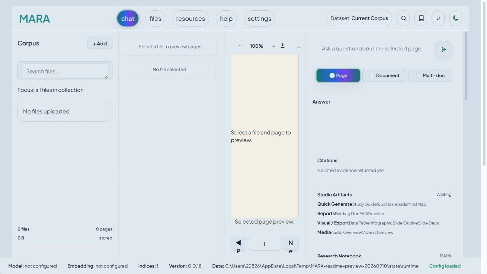

# MARA

**Multimodal Agentic Retrieval and Answering · 多模态智能体检索与问答**

围绕自己的文档提问，检查答案依据，并把阅读结果整理成笔记和学习资料。

[English](README.md) ·
[安装](#安装-web-与-cli) ·
[Web 使用](#使用-web-工作台) ·
[CLI 使用](#使用-cli) ·
[桌面端](#使用-mara-desktop-预览版) ·
[研究定位与预期结果](#研究定位与预期结果)

MARA 基于 [Kotaemon](https://github.com/Cinnamon/kotaemon) 开发，在应用层连接问题需求、
检索路由、证据身份、验证和恢复流程，并为 Web 与 CLI 提供共享的文档问答服务。
项目使用已有语言模型和检索后端；实际执行推理的模型由用户配置。

## MARA 能帮你做什么？

- 阅读论文、技术手册、财务报告和演示文稿，针对整篇文档、某一页、
  选中的段落或多个文档提问。
- 在文档预览旁检查检索片段和引用，核对答案是否有来源支持。
- 通过知识图谱探索关联，并把选中的节点作为后续提问的上下文。
- 在会话中保留选定来源、答案和研究笔记。
- 通过 Studio 生成学习指南、测验、闪卡、简报、对比表等资料，并导出受支持的格式。
- 使用 CLI 执行可重复的文档问答；使用独立的幻灯片与工作区命令检查、审阅和处理演示文稿。

**“本地优先”说明的是数据存储方式，并不自动等于离线运行。**
原始文件、索引和会话数据可以保存在本机。使用远程模型或文档处理服务时，
问题、检索内容、会话上下文或页面图片可能会发送给对应服务。
完全本地的工作流还需要本地推理、解析后端，以及已经准备好的模型和资源。

默认文件集合接收 PDF、Word（`.doc`、`.docx`）、Excel（`.xls`、`.xlsx`）、
PowerPoint（`.ppt`、`.pptx`）、CSV、HTML/MHTML、文本、Markdown、
PNG/JPEG/TIFF 图片和 ZIP 压缩包。扩展名描述的是可接收的输入范围；
能否成功提取内容，还取决于文档本身和解析器配置。

## 选择使用入口

| 入口             | 适合的任务                                             | 当前范围                                                               |
| ---------------- | ------------------------------------------------------ | ---------------------------------------------------------------------- |
| **Web 工作台**   | 阅读文档、检查证据、探索图谱、记笔记、生成 Studio 资料 | 交互功能最完整的入口，通过 Gradio 在本机浏览器运行                     |
| **MARA CLI**     | 可重复问答、批量流程、结构化输出、幻灯片操作           | `MARA docqa` 复用共享问答服务；`MARA` 与 `MARA-cli` 提供相同的公开命令 |
| **MARA Desktop** | 原生窗口、文件导入、后台索引和会话任务                 | Windows/Linux **测试预览版**，尚未覆盖 Web 的全部功能                  |

Codex 和 Claude Code 集成用于让这些工具调用 MARA，属于[可选集成](#codex-与-claude-code-集成)，
与上述三个应用入口分开介绍。

| 操作系统 | 源码安装 Web / CLI                             | 桌面发行包                                                       |
| -------- | ---------------------------------------------- | ---------------------------------------------------------------- |
| Windows  | PowerShell 安装脚本；Python 3.10               | Windows x64 预览压缩包                                           |
| Linux    | Bash 安装脚本；Python 3.10                     | Linux x64 预览包，基于 Ubuntu 22.04 构建；验证范围见对应发布说明 |
| macOS    | 提供 Bash 脚本；本地解析工具和原生依赖需要适配 | 当前打包脚本未提供 macOS 桌面包                                  |

## 安装 Web 与 CLI

### 1. 准备环境

安装 [Git](https://git-scm.com/downloads)、本地 **Python 3.10** 和 **uv 0.11.19**。
uv 版本由当前仓库的 [pyproject.toml](pyproject.toml) 锁定。

安装脚本要求 Python 已经存在，并关闭自动下载 Python。
在已有 Python 的环境中，可以这样准备 uv：

```shell
python -m pip install "uv==0.11.19"
uv --version
uv python find 3.10
```

Windows 如果 `python` 没有指向 Python 3.10，可以使用 `py -3.10 -m pip`。
macOS/Linux 的解释器命令也可能是 `python3.10`。

首次安装会下载锁定的运行时依赖，可能需要较长时间。
如果使用远程推理服务，本机不必配备 GPU；本地模型则有各自的内存和显存要求。

提供 MARA 命令的 Python 发行包名为 `mara-research-cli`。
**2026-09-10 核验时，公开 PyPI 和 TestPyPI 的该包元数据接口均返回 404。**
因此本指南以以下源码安装流程为准。

### 2. 获取源码并配置模型

```shell
git clone https://github.com/262412/MARA.git
cd MARA
```

在仓库根目录根据 [.env.example](.env.example) 创建 `.env`。

Windows PowerShell：

```powershell
Copy-Item .env.example .env
```

macOS/Linux：

```bash
cp .env.example .env
```

**在首次运行检查或启动应用之前编辑 `.env`。**
基础问答需要同时配置聊天模型和 Embedding 模型：
聊天模型负责生成答案，Embedding 模型负责把文档转成可检索的向量。

如果服务兼容 OpenAI 接口，并且**同时提供聊天与 Embedding 接口**，最小配置形如：

```dotenv
OPENAI_API_BASE=https://api.openai.com/v1
OPENAI_API_KEY=YOUR_API_KEY
OPENAI_CHAT_MODEL=YOUR_CHAT_MODEL_ID
OPENAI_EMBEDDINGS_MODEL=YOUR_EMBEDDING_MODEL_ID
```

把占位符替换为你的密钥和实际可用的模型 ID，并清空示例中未使用的其他服务密钥。
只有聊天接口的服务不能直接充当 Embedding 服务；这种情况需要在 Web 的
**resources** 中单独配置 Embedding。

如果使用 Ollama 等本地服务，先准备并启动服务，再填写它实际提供的模型名：

```dotenv
LOCAL_MODEL=YOUR_LOCAL_CHAT_MODEL
LOCAL_MODEL_EMBEDDINGS=YOUR_LOCAL_EMBEDDING_MODEL
KH_OLLAMA_URL=http://localhost:11434/v1/
```

在 resources 中选择正确的默认 **LLM** 和 **Embedding**。
填写名称不会自动下载或启动模型。

### 3. 安装锁定的运行时

在主检出目录执行安装脚本。

Windows PowerShell：

```powershell
.\install.ps1
.\.venv\Scripts\Activate.ps1
MARA app run --host 127.0.0.1
```

macOS/Linux：

```bash
chmod +x install.sh
./install.sh
source .venv/bin/activate
MARA app run --host 127.0.0.1
```

脚本根据仓库锁文件安装本地工作区包和 CLI，初始化用户配置，然后运行
`MARA app doctor`。任何一步报错，都应先处理该错误再继续。
脚本不会安装外部模型和操作系统文档处理工具。

打开终端输出的地址，通常是
[http://127.0.0.1:7860](http://127.0.0.1:7860)。
在终端按 `Ctrl+C` 停止服务。需要更换端口时：

```shell
MARA app run --host 127.0.0.1 --port 7870 --no-browser
```

端口依次取自 `--port`、`GRADIO_SERVER_PORT`、部署环境的 `PORT`，默认是 7860。

未激活虚拟环境时，Windows 可以直接运行 `.venv\Scripts\MARA.exe`，
macOS/Linux 可以运行 `.venv/bin/MARA`。

更新源码后重新执行对应安装脚本，并保留配置和运行数据的备份。
已有用户配置时，Windows 使用 `.\install.ps1 -SkipInit`，
macOS/Linux 使用 `SKIP_INIT=1 ./install.sh`，跳过重复初始化。
首次安装如果提示配置已经存在，也使用这个选项。
日常运行使用现有环境，避免把工作区包重新同步为 editable 安装。

### 4. 检查是否可以开始使用

```shell
MARA --help
MARA-cli --help
MARA doctor
MARA app doctor
MARA docqa doctor
```

这些命令分别检查命令入口、Agent/Provider 配置、应用路径和问答运行时。
`MARA app doctor` 可以通过并提示模型缺失；`MARA docqa doctor`
要求已经配置可用的默认 LLM 和 Embedding，否则会失败。
下一步还需要实际完成一次索引和有来源支持的问答。

| 可选能力                             | 额外条件                                                   |
| ------------------------------------ | ---------------------------------------------------------- |
| Word、Excel、PowerPoint 的预览与转换 | 运行环境能够调用 LibreOffice；默认转换策略较严格           |
| 扫描文档和图片文字                   | 可用的 OCR reader 及其依赖，例如 Tesseract                 |
| 视觉问答                             | 可用的页面图片证据、所需的视觉检索后端和兼容的视觉生成模型 |
| 音视频资料                           | 对应类型所需的渲染后端与媒体工具；仅安装 CLI 并不足够      |

建议先使用仓库附带的 Markdown 示例，再排查复杂文件格式。
容器方式见 [Docker 使用说明](docs/development/container-usage.md)。

## 使用 Web 工作台



这是在独立空白工作区中实际启动后截取的界面。
截图来源与可补充的操作场景见[截图说明](docs/images/README.md)。

1. **检查模型。** 打开 **resources**，检查 LLM 和 Embedding 条目并设定默认模型。
   应用可能已经存在之前保存的配置。
2. **导入来源。** 打开 **files**，或使用来源面板中的添加/上传功能。
   上传 [mara-quickstart.md](docs/examples/mara-quickstart.md) 或自己的小文档，
   等待索引成功。
3. **选择范围。** 选定文件后用 **Document** 对整篇文档提问；
   **Page** 需要选定页面，**Multi-doc** 需要选定多个来源。
   针对选中文本的问题还需要提供对应段落。
4. **提问。** 对示例可以问：
   “How many reports are in the pilot, and how are they split by format?”
5. **核对依据。** 示例原文写明：**共 12 份报告，其中 8 份 PDF、4 份演示文稿**。
   检查回答的引用与来源上下文；不同模型的具体表述可能不同。
6. **整理阅读结果。** 保存答案或笔记，根据选定来源生成 Studio 资料，
   或在知识图谱中选择节点继续提问。

示例是虚构演示材料。这里的预期答案来自示例原文，并不是已运行的 benchmark 成绩。

对带页面的来源，可以结合引用和预览检查具体页码与片段。
仍需分别判断证据覆盖是否充分、引用是否对应、答案是否正确。

## 使用 CLI

在已经激活的环境中运行这些命令，并使用与 Web 工作区一致的运行时配置。

### 导入、提问与恢复会话

```shell
MARA docqa index docs/examples/mara-quickstart.md
MARA docqa files
MARA docqa ask --file mara-quickstart.md --prompt "How many reports are in the pilot, and how are they split by format?" --reasoning mara --route doc --citation inline
MARA docqa sessions
```

`index` 可以接收多个路径。先查看是否有索引失败，再确认文件出现在 `files` 中。
`ask --file` 通过 ID 或名称选择**已经索引的文件**，不会替代导入步骤。
当文件同名时，优先使用文件 ID。

普通文本响应包含会话 ID、答案和可用的证据信息。
MARA 推理流程还可能输出路由、检索、验证和模态信息。
自动化处理时可以加 `--json` 获取结构化结果。

将以下 `CONVERSATION_ID` 替换成返回的会话 ID：

```shell
MARA docqa ask --conversation CONVERSATION_ID --prompt "List the review stages."
MARA docqa resume CONVERSATION_ID
```

`MARA docqa chat` 用于启动交互问答，其中支持 `/files`、`/use`、
`/page`、`/selected-text`、`/history` 和 `/exit`。

### 指定问答范围

先索引以下示例中的文件，再用对应的文件名称或 ID：

```shell
MARA docqa ask --file report.pdf --page 3 --prompt "Explain the table on this page."
MARA docqa ask --file report.pdf --selected-text "operating margin" --prompt "Explain this passage."
MARA docqa ask --file report-a.pdf --file report-b.pdf --scope multi-document --prompt "Compare the stated assumptions." --reasoning mara --task compare
```

### 检查路由与验证

Controller 可以根据配置在直接回答、文本检索、视觉、元素、图谱和混合路径间选择；
当配置的策略无法取得足够支持时，也可以拒答。
实际可用路径取决于索引中的证据与已配置后端。

```shell
MARA docqa ask --file mara-quickstart.md --prompt "Summarize the pilot and cite the source." --reasoning mara --controller llm --route auto --verify light --json
```

这个命令显式启用了 Controller 规划和轻量验证。
CLI 的 `--controller` 和 `--verify` **默认都是 off**。
路由标签本身不能证明图片已经送入视觉模型，验证状态也不能保证事实正确。
可以通过 `MARA docqa ask --help` 查看模型、路由、上下文长度和语言选项。

### 生成和导出学习资料

```shell
MARA docqa artifacts generate CONVERSATION_ID --type study_guide --file mara-quickstart.md --prompt "Create a short guide to the pilot."
MARA docqa artifacts list CONVERSATION_ID
MARA docqa artifacts export CONVERSATION_ID --artifact ARTIFACT_ID --format md --output study-guide.md
```

把会话与产物 ID 替换成实际返回值。其他类型包括测验、闪卡、思维导图、
幻灯片提纲、简报、FAQ、时间线、自定义报告、数据表、信息图、幻灯片和音视频概览。
支持的导出格式包括 Markdown、HTML、JSON、CSV、SVG、PPTX、MP3、MP4，
**具体取决于产物类型与已安装的依赖**。

`MARA docqa sources` 与 `MARA docqa notes` 管理会话笔记本的来源和笔记。
使用对应命令的 `--help` 查看参数。

### 幻灯片工具与模型路由

幻灯片检查使用独立于文档问答的工作流：

```shell
MARA inspect --file slides.pptx
MARA read-slide --file slides.pptx --slide 1
MARA extract --file slides.pptx
MARA review --file slides.pptx
MARA run --file slides.pptx --prompt "Rewrite the opening for executives." --dry-run
```

| 命令                                         | 用途                                 |
| -------------------------------------------- | ------------------------------------ |
| `MARA inspect`、`MARA read-slide`            | 检查整份演示文稿或其中一页           |
| `MARA extract`、`MARA search`、`MARA review` | 提取文本、搜索内容或执行确定性审阅   |
| `MARA files`、`MARA read`                    | 列出工作区文件或读取文本文件         |
| `MARA write`、`MARA delete`、`MARA shell`    | 写入/删除工作区文件或执行 Shell 命令 |

顶层 `run`、`chat`、`sessions`、`resume` 管理幻灯片 Agent 会话。
`apply` 和 `export-pdf` 处理演示文稿输出；
`files`、`read`、`write`、`delete`、`shell` 操作工作区文件。
其中 `MARA docqa delete` 删除的是已索引来源，不能作为删除已保存会话的命令，
也与 `MARA delete` 的工作区文件删除语义不同。

独立的模型路由配置可以这样检查，它不会直接更改 Web 的默认模型：

```shell
MARA model init-config --output modelcli.yml
MARA model providers --config modelcli.yml
MARA model run --help
```

## 使用 MARA Desktop 预览版

桌面端使用 Electron、React 与内置 Python 服务。
当前源码已接入原生文件导入、后台索引、文件管理、会话新建/搜索/重命名/删除、
文档与多文档问答、流式答案、停止和重试。

页级/选中文本范围、引用跳转与预览、Notes、Studio、完整资源/设置管理以及数据迁移
仍有未完成工作。具体进展和验收证据见[功能矩阵](docs/desktop/feature-parity-matrix.md)。

### 下载预览包

[索引准备状态修复预览版](https://github.com/262412/MARA/releases/tag/desktop-gate3-preview-4112e99)
提供 Windows x64、Linux x64 压缩包和 `SHA256SUMS.txt`。
这是固定的测试版本，能力可能少于当前源码。
可以在 [Releases](https://github.com/262412/MARA/releases) 中检查更新且未撤回的预览版及其说明。

1. 从同一个 Release 下载适合系统的压缩包和校验文件。
2. 核验 SHA-256 后，**完整解压**压缩包。
3. Windows 在解压的应用目录中运行 `MARA.exe`；Linux 运行解压后的 `MARA`。
4. 检查运行状态和模型设置，配置聊天与 Embedding，导入小文件并等待索引完成，
   然后开始会话。
5. 检查答案和任务完成状态；尚未接入的功能使用 Web 工作台。

预览包自带运行时，使用者无需另外安装 Python 或 Node.js。
保留可执行文件及其配套资源，不要只复制一个 exe。
对应发布说明仍将该包的 Windows 10/11 产品验收列为待完成。
当前文档不把这些压缩包描述为稳定版安装器，也不承诺 macOS 桌面支持。

### 运行当前桌面源码

先完成前面的 Python 运行时安装。
桌面开发还需要 **Node.js 22.12 或更高版本**和 npm。

Windows PowerShell，在仓库根目录执行：

```powershell
$env:MARA_DESKTOP_PYTHON = (Resolve-Path .venv\Scripts\python.exe).Path
cd apps/desktop
npm ci
npm start
```

Linux，在仓库根目录执行：

```bash
export MARA_DESKTOP_PYTHON="$PWD/.venv/bin/python"
cd apps/desktop
npm ci
npm start
```

`npm start` 会构建应用并启动 Electron。
契约验证、测试和原生打包见[桌面开发说明](apps/desktop/README.md)。

桌面端使用独立数据目录：Windows 通常是 `%APPDATA%/MARA`，
Linux 是 `$XDG_DATA_HOME/MARA` 或 `~/.local/share/MARA`。
不要假定它会自动打开 Web/CLI 的旧数据库，或支持不同入口同时写入同一份数据。

## 配置与数据保存

| 设置或位置                                        | 用途                                                     |
| ------------------------------------------------- | -------------------------------------------------------- |
| 仓库 `.env` 与 [flowsettings.py](flowsettings.py) | 源码工作区的模型默认值和应用设置                         |
| `MARA app init`                                   | 创建用户级配置模板；`app doctor` 显示实际生效的路径      |
| 用户配置目录中的 `.env` / `flowsettings.py`       | 没有工作区或显式设置模块覆盖时，供 packaged runtime 使用 |
| `KH_APP_DATA_DIR`                                 | 覆盖应用数据目录                                         |
| `modelcli.yml`                                    | `MARA model` 与 Agent 流程的独立 Provider/模型别名配置   |
| 桌面 Settings 与其数据目录                        | 桌面端负责的模型设置与应用状态                           |

运行时会依次检查显式的 `THEFLOW_SETTINGS_MODULE`、工作区 `flowsettings.py`、
packaged defaults。因此，从仓库内和其他目录执行命令，可能使用不同配置。
在期望 Web 与 CLI 看到相同文件之前，先比较 `MARA app doctor` 中的
**Settings source**、**App data dir** 和 **File storage**。

源码模式默认使用 `ktem_app_data/`。
为兼容已有安装，packaged runtime 的平台目录仍保留 **Cinnamon/Kotaemon** 名称；
以 Doctor 输出的实际路径为准。

LLM 与 Embedding 条目会保存到应用数据库中。
修改 `.env` 可以提供默认值，但**不会覆盖已经存在的同名 Provider 记录**。
需要在 **resources** 中更新对应条目并确认默认选择。
更换 Embedding 模型后，文档可能需要重新索引。

备份时先停止应用，再保存完整数据目录，包括上传文件、索引和会话/数据库状态。
凭据应放在 Git 之外。

### 网络访问与认证

本地示例绑定到 `127.0.0.1`。
需要向网络接口提供服务时，先配置 `MARA_AUTH_MODE=password` 并创建管理员，
或者配置 `MARA_AUTH_MODE=sso` 与 Google/Keycloak 参数。
只修改监听地址不会创建认证配置。

`MARA app init --help` 说明了新用户配置的密码初始化方式。
初始化会使用显式指定的 `KH_APP_DATA_DIR`，否则使用 packaged data directory；
应确保它与实际提供服务的数据目录一致。
使用 `--force` 重新初始化会重建用户 `.env` 和 `flowsettings.py`，
并可能重置已有管理员，应在有意迁移时备份并恢复需要保留的设置。
[容器说明](docs/development/container-usage.md) 提供了完整的密码文件与持久化卷示例。

## Codex 与 Claude Code 集成

MARA 提供两个工具的支持包，用于安装 MARA 指令和技能。
宿主工具本身需要另外安装。
其中 `MARA-docqa-ask`、`MARA-docqa-index`、`MARA-docqa-delete`
分别面向单次提问、文档导入和已索引来源删除。

```shell
MARA platform list
MARA platform install --platform codex --mode full --dry-run
MARA platform install --platform codex --mode full --yes
MARA platform validate --platform codex --installed
```

Claude Code 将 `codex` 替换为 `claude-code`。
默认目标分别是 `~/.codex` 和 `~/.claude`；
也可以用 `--target-dir` 指定其他位置。
合并与备份规则见[平台支持说明](docs/development/platform-cli-support.md)。

仓库的 [.codex](.codex) 保存 MARA 共享支持资产；
[.github](.github) 保存自动化配置；
[.githooks](.githooks) 保护共享开发环境。
这些目录的点号前缀并不意味着它们是缓存。
保留和清理规则见[目录说明](docs/development/repository-directory-guide.md)。

## 研究定位与预期结果

MARA 的研究重点是把显式问题需求、集中式路由选择、规范化证据身份、
可配置验证/恢复和共享运行时服务连接起来。
[论文记录仓库](https://github.com/262412/MARA-dissertation-records)
说明了设计、依据和适用边界。

本次 README 参考的论文修订版本为
[`38846af`](https://github.com/262412/MARA-dissertation-records/tree/38846af48bcec410d89150351a3d1e1541cd7bc3/dissertation)。
论文区分了当前实现/回归测试证据与独立保存的六任务评测。
任务涵盖 FinanceBench、QASPER、RAGTruth、ALCE-ASQA、MMDocRAG 和 SlideVQA，
采用的是选定的**本地任务适配**。

已有比较没有证明 Controller 具有普遍的答案质量优势。
部分配置存在较高的错误拒答比例，答案重合度也可能与证据质量表现不一致。
原始记录缺失和未完成的真实跨界面对照限制了复现与一致性结论。
因此，不应把本项目理解为保证达到公开榜单成绩、引用永远正确，
或复杂路由在每个问题上都能给出更好答案。

新安装环境可以用以下具体结果作为验收目标：

| 操作                 | 需要看到和检查的结果                                        |
| -------------------- | ----------------------------------------------------------- |
| 启动运行时           | 页面可以打开；Doctor 显示预期数据路径，并说明缺失的模型配置 |
| 导入小文档           | 索引结束且没有报告失败，文件出现在来源列表                  |
| 回答 quickstart 问题 | 正确回答原文中的 12 / 8 / 4 数量，并有可以检查的来源支持    |
| 继续会话             | 同一运行时与用户下可以恢复历史和选定上下文                  |
| 生成学习资料         | 产物可以被保存、列出、打开，并按受支持格式导出              |

这些是对你的具体配置提出的验收目标，不代表所有模型和格式已经通过验证。
程序成功退出本身不能替代结果检查。

[Benchmark 框架](benchmark/README.md) 提供评测入口与产物约定。
分析时应同时查看逐例预测、引用、终态、失败记录、评分来源和汇总指标。

## 常见问题

| 现象                         | 优先检查                                                         |
| ---------------------------- | ---------------------------------------------------------------- |
| uv 版本不匹配或找不到 Python | 使用 uv 0.11.19 和已经安装的 Python 3.10；脚本不会自动下载解释器 |
| 安装后找不到 MARA 命令       | 激活正确环境，或使用其完整可执行文件路径                         |
| UI 能打开但索引失败          | 默认 Embedding、服务地址、密钥与解析器是否正确                   |
| 修改 .env 没有生效           | 当前设置来源，以及 resources 中已经保存的模型条目                |
| Web 和 CLI 看不到同一批文件  | 数据路径、用户身份、选定来源和会话上下文是否一致                 |
| Office 或扫描文档失败        | 转换/OCR 依赖是否齐全；先确认简单 Markdown 可以索引              |
| 缺少证据或频繁拒答           | 来源范围、检索结果、后端可用性与验证模式                         |
| 桌面端缺少某项功能           | 查看对应预览发布说明和功能矩阵，使用 Web 中更完整的入口          |
| 默认端口被占用               | 使用 `MARA app run --port 7870`                                  |

## 仓库与开发

```text
apps/desktop/       Electron/React 桌面应用和 Python 适配层
libs/slide_cli/     MARA / MARA-cli 命令实现
libs/ktem/          Web UI、文档问答运行时、会话和应用服务
libs/kotaemon/      检索、模型、文档处理和平台支持包
benchmark/         评测运行器、适配器和分析
docs/              用户、架构、桌面与开发文档
scripts/           验证、打包、安装辅助和 HPC 工具
```

内部包名保留了与 Kotaemon 基础代码的兼容性。

非平凡改动应遵循[代码卫生契约](docs/development/codebase-hygiene-contract.md)
和[存储/环境契约](docs/development/storage-layout-contract.md)；
后者也记录了维护者的 HPC 专用路径。
只有主检出目录拥有 canonical environment；
关联 worktree 使用 `scripts/run_with_canonical_env.sh`。

在已经准备好测试依赖的主开发环境中，使用不重新同步依赖的验证命令：

```shell
uv run --no-sync --python 3.10 python scripts/check_codebase_hygiene.py path/to/changed.py
```

修改 CLI 时，在 `libs/slide_cli` 下运行包级验证：

```shell
uv run --no-sync --python 3.10 python -m pytest -q
```

不要通过刷新卫生基线掩盖失败。
贡献说明见 [CONTRIBUTING.md](CONTRIBUTING.md)。

## 许可与致谢

MARA 使用 [Apache License 2.0](LICENSE.txt)，
[NOTICE](NOTICE) 保留了 [Cinnamon/Kotaemon](https://github.com/Cinnamon/kotaemon)
的上游归属信息。模型、数据集和可选服务遵循各自的许可与条款。
