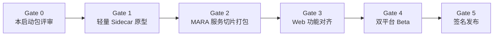

# MARA Desktop 开发启动包

状态：**正式开发前基线（待评审）**

冻结日期：2026-07-30

本目录把 MARA Desktop 的产品范围、界面方向、技术架构、安全边界、
双平台发布方式和验收门槛固定下来。它不是一份概念说明，而是正式开发时
拆分任务、做架构评审和判断功能是否完成的共同依据。

## 已冻结的产品决策

| 项目         | 决策                                                                 |
| ------------ | -------------------------------------------------------------------- |
| 目标平台     | Windows 10/11 x64；Ubuntu 22.04/24.04 x64                            |
| 代码库       | 一套业务代码；平台适配与打包在边界层分开                             |
| 技术栈       | Electron + React + Python Sidecar                                    |
| 功能范围     | 现有 Web UI 功能对齐 + 必要桌面能力                                  |
| 设计方向     | 采用 Codex 类桌面工作台的信息架构，不复制其专属功能或每个视觉细节    |
| 运行方式     | 安装后可直接运行；最终用户不需要自行安装 Python、Node.js 或 MARA CLI |
| 现有产品兼容 | 不破坏 `MARA` / `MARA-cli`、DocQA、Gradio Web UI 和已有数据          |

## 文档清单

1. [产品需求](product-requirements.md)：目标用户、范围、用户流程、完成定义。
2. [功能对齐矩阵](feature-parity-matrix.md)：Web UI 能力、桌面新增能力和优先级。
3. [界面与交互规范](ux-design-spec.md)：三栏结构、组件状态、快捷键和设计令牌。
4. [架构说明](architecture.md)：进程边界、接口、生命周期、数据目录和迁移路线。
5. [ADR-0001](adr/0001-electron-react-python-sidecar.md)：技术选择及其约束。
6. [安全与风险登记册](security-and-risk-register.md)：威胁模型、风险、缓解和放行条件。
7. [发布与验收计划](release-and-acceptance-plan.md)：Windows/Linux 构建矩阵和质量门。
8. [技术原型结果](technical-spike-results.md)：Gate 1 的实测证据、发现和边界。
9. 技术原型（`apps/desktop/README.md`）：可运行的三栏壳层与 Sidecar 生命周期验证。
10. [Gate 2 纵向切片证据](gate-2-vertical-slice-evidence.md)：Doctor、Files、
    Sessions 的实现、测试、Linux 包指标和跨平台待验收项。
11. [Gate 3 文件索引纵向切片证据](gate-3-file-indexing-evidence.md)：原生导入、
    后台索引、刷新/删除、格式矩阵和故障恢复证据。
12. [Gate 3 会话详情纵向切片证据](gate-3-session-detail-evidence.md)：真实会话读取、
    窄 IPC、首次并发初始化回归和跨平台组合包证据。
13. [Gate 3 会话管理纵向切片证据](gate-3-session-management-evidence.md)：搜索、
    重命名、删除、幂等契约和跨平台组合包证据。
14. [Gate 3 会话新建纵向切片证据](gate-3-session-creation-evidence.md)：真实新建、
    快捷键、并发互斥和跨平台组合包证据。
15. [Gate 3 真实问答纵向切片证据](gate-3-query-streaming-evidence.md)：文档/多文档
    来源范围、流式回答、取消/重试、安全引用和跨平台组合包证据。

## 阶段门

| 阶段   | 必须回答的问题                                    | 出口条件                                                         |
| ------ | ------------------------------------------------- | ---------------------------------------------------------------- |
| Gate 0 | 做什么、为什么、做到什么算完成                    | 冻结本文档中的范围、架构和验收口径                               |
| Gate 1 | Electron 能否安全启动、检查和关闭独立 Python 进程 | 原型测试、构建和人工视觉检查通过                                 |
| Gate 2 | 真实 MARA 依赖能否在两平台自包含打包              | 文件、会话和 doctor 服务切片完成；记录体积、启动时间、原生库问题 |
| Gate 3 | 是否达到 Web UI 功能对齐                          | P0 功能矩阵全部有自动化或人工验收证据                            |
| Gate 4 | 是否能在目标系统稳定安装、升级和迁移              | 四个目标系统的安装、升级、卸载和恢复测试通过                     |
| Gate 5 | 是否可对外分发                                    | Windows 签名、Linux 校验、SBOM、发布说明和回滚方案齐备           |

## 本阶段不改变的公共表面

- `MARA` 与 `MARA-cli` 命令、参数和退出码。
- `MARA docqa` 会话、索引、笔记、来源选择与 artifact 语义。
- 当前 Gradio Web UI 的行为和启动方式。
- 已有 SQLite、索引、上传文件与知识图谱缓存的格式。

Desktop 在开发期间是新增入口。只有经过独立迁移设计、备份和兼容测试，
才能让它写入现有持久化数据。
