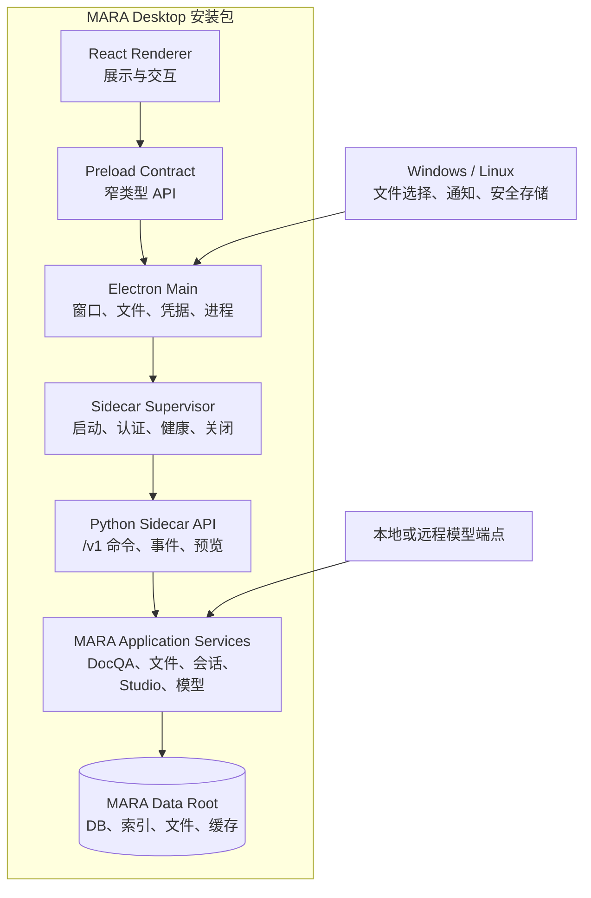
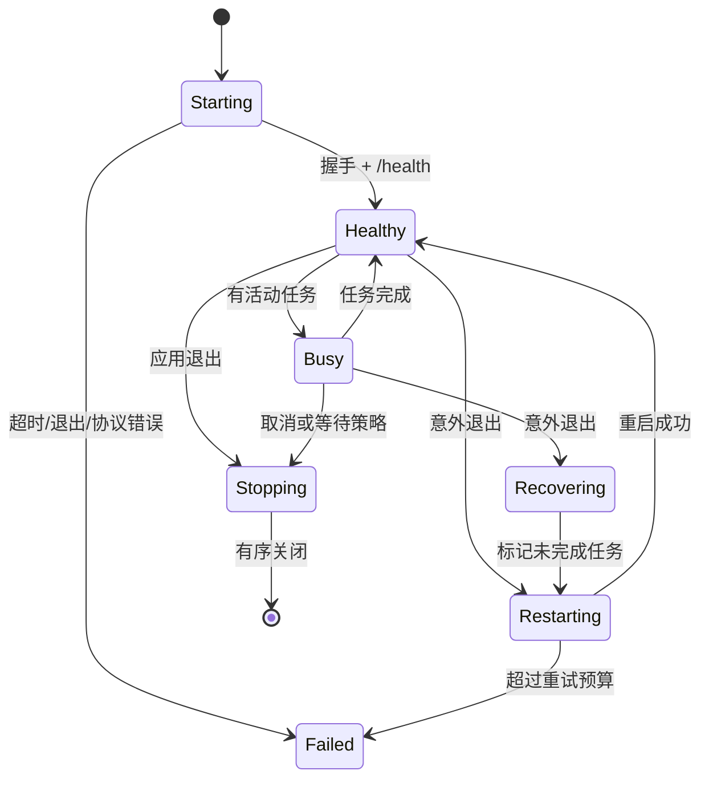

# MARA Desktop 架构说明

## 1. 目标架构



### 分层职责

| 层                        | 负责                                               | 不负责                              |
| ------------------------- | -------------------------------------------------- | ----------------------------------- |
| React Renderer            | 视图状态、交互、可访问性、流式呈现                 | 文件系统、进程、密钥、任意网络代理  |
| Preload                   | 暴露少量稳定、可校验的桌面 API                     | 透传 `ipcRenderer` 或 Electron 对象 |
| Electron Main             | 窗口、原生对话框、权限、系统凭据、Sidecar 生命周期 | DocQA 业务逻辑                      |
| Sidecar Supervisor        | 随机端口/令牌、握手、健康、重启、关闭              | 长期保存业务数据                    |
| Python API                | 版本化命令、事件流、参数校验、错误模型             | Gradio 组件或 HTML                  |
| MARA Application Services | 当前 DocQA、索引、预览、图谱、Studio、模型路由     | Electron/React 类型                 |
| Adapters/Persistence      | SQLite、向量库、文件和平台路径                     | UI 状态                             |

当前 Gradio UI 保持独立入口。Desktop 复用它下方的领域服务，不嵌入
`MARA app run` 页面，也不让 React 调用 Gradio 事件链。

## 2. 进程与通信契约

### 启动握手

1. Electron Main 生成 256-bit 随机会话令牌。
2. 启动内置 Sidecar，可执行文件只绑定 `127.0.0.1:0`。
3. Sidecar 在 stdout 输出一行 JSON：

   ```json
   {
     "type": "ready",
     "protocol": 1,
     "port": 43127,
     "pid": 12345
   }
   ```

4. Main 验证字段、进程 PID 和协议版本，再调用带 Bearer 令牌的 `/health`。
5. Renderer 只收到脱敏后的 `{state, version, capabilities}`，不会得到端口或令牌。

握手超时、协议不兼容或健康检查失败进入诊断页，不直接退出或白屏。

### API 形态

- 控制和查询：回环 HTTP JSON，路径以 `/v1` 开头。
- 长任务：创建命令返回 `task_id`；事件使用 SSE。只有出现真实双向需求时才引入
  WebSocket。
- 二进制预览：Sidecar 返回短期、单用途的流句柄；Renderer 不接收任意本地路径。
- 每个命令有 `request_id`，可重试写操作还需要 idempotency key。
- 错误使用稳定的 `code`、面向用户的 `message`、可选 `details` 和
  `retryable`，不把 Python traceback 直接显示给用户。
- API Schema 由 Python 生成 OpenAPI，并生成 TypeScript 客户端类型；CI 检查漂移。
  当前生成入口为 `npm run contracts:generate`，提交产物为
  `apps/desktop/shared/api-contracts.generated.ts`，`npm run contracts:check`
  对照实时 FastAPI schema 并在漂移时失败。

### IPC

Renderer 到 Main 只开放按能力命名的方法，例如：

- `desktop.getRuntimeStatus()`
- `desktop.getDoctor()`
- `desktop.listFiles()`
- `desktop.listSessions()`
- `desktop.getSession(sessionId)`
- `desktop.createSession()`
- `desktop.renameSession(sessionId, name)`
- `desktop.deleteSession(sessionId)`
- `desktop.importFiles()`
- `desktop.importDroppedFiles(files)`
- `desktop.getLatestIndexTask()`
- `desktop.cancelIndexTask(taskId)`
- `desktop.retryIndexTask(taskId)`
- `desktop.deleteFile(fileId)`
- `desktop.deleteFiles(fileIds)`
- `desktop.onIndexTaskStatus(listener)`
- `desktop.saveArtifact(options)`
- `desktop.revealPath(handle)`
- `desktop.getCredentialState(provider)`
- `desktop.setCredential(provider, secret)`

不得暴露通用 `invoke(channel, ...args)`、任意 shell、任意 URL 打开或任意文件读取。
Main 必须校验 IPC sender、参数、文件句柄和允许的外部 URL 协议。

会话详情通过认证后的 `GET /v1/sessions/{conversation_id}` 读取，application
service 直接复用 `DocQARuntime.load_session()` 的所有者/公开会话授权语义。响应只
投影会话 ID、名称、用户/助手文本、来源 ID、origin、公开标记和时间，不返回
`data_source`、用户 ID、settings、检索内部状态或本地路径。Main 与 Sidecar 都校验
不透明会话 ID；Renderer 在用户选择后才请求，并丢弃切换任务产生的过期响应。该
只读切片不启用 reasoning、模型调用或通用请求能力。Sidecar 把共享 DocQA
collectors 和 runtime 初始化放在同一 application-service 锁内，避免并行首启请求
覆盖全局 runtime 能力裁剪；冻结包必须用并行 Doctor、Files、Sessions 和会话详情
请求回归该边界。

会话管理继续使用相同的窄边界：认证 Sidecar 增加
`POST /v1/sessions`、
`PATCH /v1/sessions/{conversation_id}` 和
`DELETE /v1/sessions/{conversation_id}`，三种写操作都要求 idempotency key。新建请求
只接受空对象，直接调用现有 `DocQARuntime.create_session()`；重命名名称去除首尾空白后
必须为 1–200 个 Unicode 字符，删除只返回不透明会话 ID。Sidecar 继续使用 owner
scope，且不改变 `Conversation` schema 或 `data_source` 形状。Preload 仅暴露
`desktop.createSession()`、`desktop.renameSession(sessionId, name)` 和
`desktop.deleteSession(sessionId)`，Main 重新验证 sender、参数数量、ID 和名称。左栏
搜索只过滤已经脱敏的 Session summaries；新建与其他会话写操作互斥，不会新增任意查询
或本地路径能力。

Gate 3 的文件导入由 Main 打开原生选择器；Renderer 不传选择器参数，也不会收到
绝对路径。Main 只把选择结果送入带认证的 Sidecar 索引命令。Sidecar 返回脱敏的
任务 ID、文件名、计数和状态，事件通过 SSE 送到 Main 后再投影为明确的 IPC 事件。
索引任务日志位于独立 Desktop 数据根，应用重启后会把中断任务标记为可重试失败，
不会静默丢失任务。日志通过同目录临时文件原子替换；首次持久化遇到磁盘满时，
任务和 idempotency 登记一起回滚，不会留下永远不执行的 queued 任务。运行中持久化
失败会投影为脱敏、可重试状态。磁盘满和数据库锁分别使用稳定的
`index_storage_full`、`index_database_locked` 错误码，原始异常和本地路径不进入
Renderer。

拖放沿用同一边界：Renderer 只把浏览器 `File` 对象交给
`desktop.importDroppedFiles(files)`；Preload 在隔离上下文中使用 Electron
`webUtils.getPathForFile()` 取得磁盘路径，并直接发送到专用 IPC，不把路径返回
Renderer。Main 再校验 sender、1–64 个绝对且唯一的路径及当前 FileIndex 支持扩展名，
随后复用相同的 Sidecar 索引任务。合成的 JavaScript `File` 没有磁盘路径，必须失败
关闭。

批量删除使用认证的 `POST /v1/file-deletions`，请求只包含 1–1,000 个唯一、不透明的
文件 ID，并要求 idempotency key。Preload 和 Main 对同一 ID 列表再次执行 sender、
数量、格式和去重校验；Renderer 不能用该方法提交文件路径。Sidecar 仍把整个列表
交给现有 `DocQARuntime.delete_files()`，不复制 Web/CLI 删除逻辑。

原生选择器的扩展名过滤器来自认证后的 `GET /v1/import-capabilities`。该端点读取
当前持久化 FileIndex 配置；尚未创建索引时回退到 MARA 默认 FileIndex 定义。Main
只接受规范化的 `.extension` 列表并去掉前导点交给 Electron，Renderer 不接收配置
或本地路径。OpenAPI 生成类型和打包 smoke 同时锁定该契约，避免 Desktop 手写一份
会与 Web/CLI 漂移的格式列表。

Gate 3 的 Desktop Sidecar 在 runtime settings 初始化前固定
`KH_OFFICE_TO_PDF_INDEXING=false`。自包含包不依赖用户另装 LibreOffice 或
Microsoft Word，DOCX、XLSX 和 PPTX 索引直接复用 MARA 现有文本读取器。该策略只
提供可搜索文本，不声称布局保真或 Office 预览已经完成；后续预览切片必须单独检测
转换器、明确降级并完成格式视觉验收。CLI 和 Web 的默认 Office 转 PDF 策略不变。

Gate 3 的仅索引 runtime 同时关闭问答注册和文件导出 artifact 发布。后者当前依赖
POSIX `dir_fd` 的 fail-closed 安全边界，不能在 Windows 上用普通路径操作降级。
Desktop 到 Studio/原生导出切片时，必须先实现等价的 Windows 安全文件句柄后端，
再启用该能力；现有 Web/CLI runtime 默认仍生成完整 artifact 与 manifest。

## 3. Sidecar 生命周期



- 正常退出先停止接受新任务，再取消或等待当前任务，提交/回滚事务，最后关闭进程。
- Main 保留最多 3 次、指数退避的自动重启预算；连续失败后要求用户进入诊断页。
- Sidecar 监视父进程 stdin；父进程崩溃导致管道关闭时自行退出。
- 关闭超时后才强制终止，且下次启动必须运行数据一致性检查。
- 暂停/休眠恢复后重新做健康检查，不假设旧连接仍有效。

## 4. 数据目录与兼容

### 新安装默认目录

| 平台    | 数据根目录                                            |
| ------- | ----------------------------------------------------- |
| Windows | `%APPDATA%\\MARA`                                     |
| Linux   | `$XDG_DATA_HOME/MARA`，未设置时 `~/.local/share/MARA` |

数据根目录下按用途分为：

```text
MARA/
├── state/        # SQLite、索引元数据、会话
├── documents/    # 受管文档副本
├── previews/     # 可重建预览
├── cache/        # 可清理缓存和模型资源
├── logs/         # 轮转且脱敏的日志
├── backups/      # 迁移和升级前备份
└── tmp/          # 启动时可清理的临时文件
```

Electron Main 在启动 Sidecar 时显式传入数据根目录；Sidecar 再把当前运行时需要的
`KH_APP_DATA_DIR` 指向兼容子目录。不得依赖当前工作目录或开发机环境变量。

### 旧数据迁移

1. 只读探测现有 `KH_APP_DATA_DIR` 或用户选定目录。
2. 记录 schema、应用版本、文件数、容量和校验结果。
3. 在新目录创建完整备份或可验证快照。
4. 复制到 staging，执行逐版本迁移并验证。
5. 原子切换新数据目录；旧目录保持不变。
6. 提供回滚和“继续使用独立新库”选项。

开发期默认使用独立数据目录。任何双向写入旧 Web/CLI 数据空间的方案都需要
新的并发、锁和迁移 ADR。

## 5. 自包含打包

- Renderer 与 Electron Main 使用锁定的 npm 依赖构建。
- Python Sidecar 使用 PyInstaller `onedir` 优先做调试和依赖审计，体积稳定后再评估
  `onefile`。PyInstaller 产物包含 Python 解释器，用户无需安装 Python。
- PyInstaller 不是跨平台编译器，因此 Windows 和 Linux Sidecar 必须在各自原生
  CI runner 上构建。
- Linux 以 Ubuntu 22.04 为最低构建基线，并在 22.04/24.04 分别安装测试，避免
  从新 glibc 构建后无法在旧系统运行。
- 模型权重、可选 OCR/VLM 资源不默认塞进安装器；首次使用时通过可恢复下载管理器
  安装，并展示体积、来源和校验值。

技术原型只验证轻量 Sidecar 的进程链、认证和 UI 壳层。Gate 2 必须再用真实
MARA 文件/会话/doctor 服务切片测量包体、冷启动、原生库和杀毒软件行为。

## 6. 现有代码迁移路线

1. 为当前 Python 行为补充特征测试，特别是会话、来源身份、引用定位和 artifact。
2. 从 Gradio callback 中提取无 UI 的 application service；Web UI 行为不变。
3. 在同一服务上增加版本化 Sidecar API adapter。
4. React 先实现文件、会话和 doctor 切片，再按功能矩阵逐域替换。
5. 每个域只有在 Web 与 Desktop 契约测试都通过后，才标记功能对齐。

不得通过复制一套 DocQA 核心逻辑来换取短期进度。

## 7. 外部技术依据

- [Electron Process Model](https://www.electronjs.org/docs/latest/tutorial/process-model)
- [Electron Security](https://www.electronjs.org/docs/latest/tutorial/security)
- [Electron Distribution](https://www.electronjs.org/docs/latest/tutorial/distribution-overview)
- [Electron autoUpdater](https://www.electronjs.org/docs/latest/api/auto-updater/)
- [Electron safeStorage](https://www.electronjs.org/docs/latest/api/safe-storage)
- [PyInstaller operating mode](https://pyinstaller.org/en/stable/operating-mode.html)
