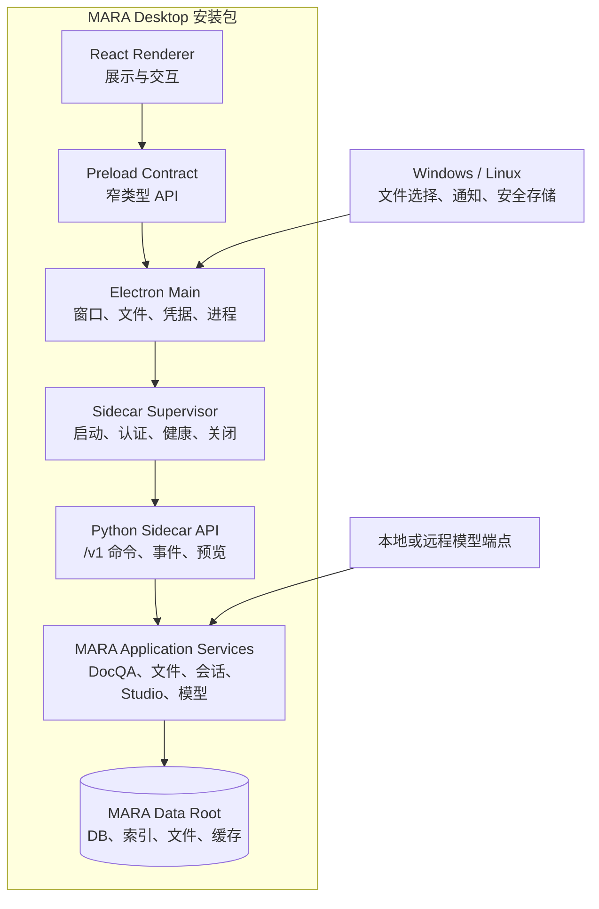
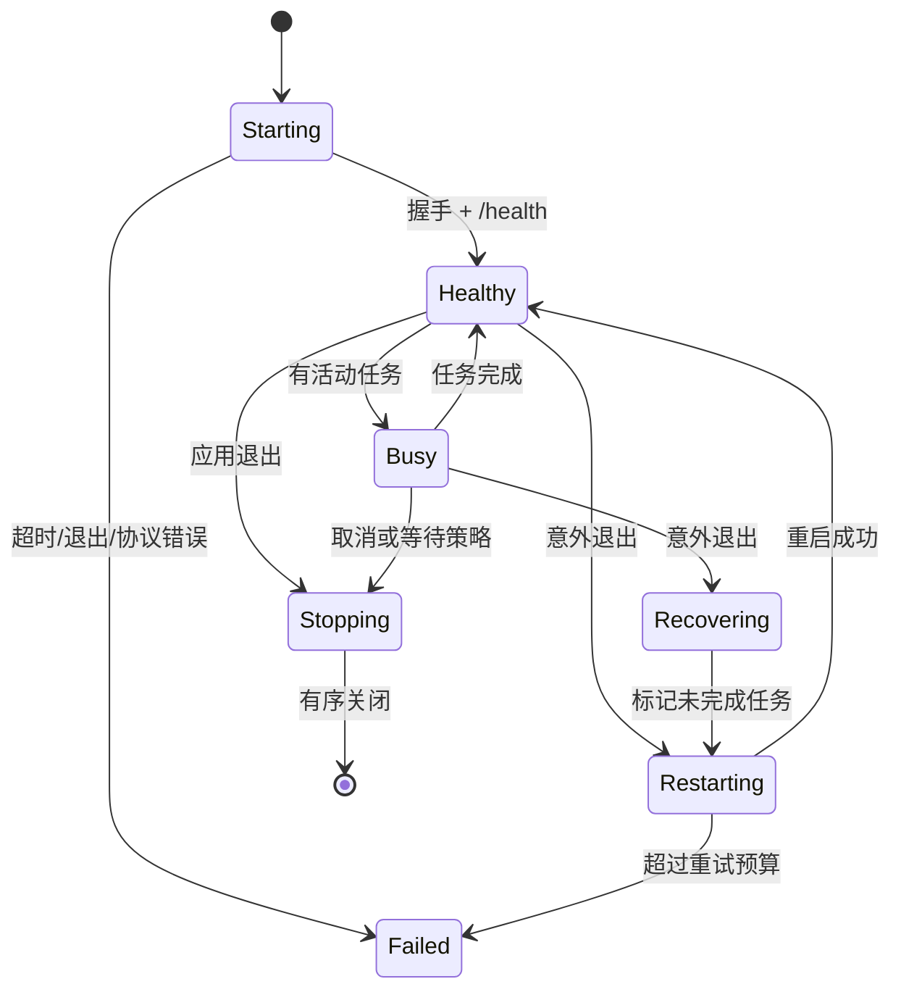

# MARA Desktop 架构说明

## 1. 目标架构



### 分层职责

| 层                        | 负责                                               | 不负责                              |
| ------------------------- | -------------------------------------------------- | ----------------------------------- |
| React Renderer            | 视图状态、交互、可访问性、流式呈现                 | 文件系统、进程、密钥、任意网络代理  |
| Preload                   | 暴露少量稳定、可校验的桌面 API                     | 透传 `ipcRenderer` 或 Electron 对象 |
| Electron Main             | 窗口、原生对话框、权限、系统凭据、Sidecar 生命周期 | DocQA 业务逻辑                      |
| Sidecar Supervisor        | 随机端口/令牌、握手、健康、重启、关闭              | 长期保存业务数据                    |
| Python API                | 版本化命令、事件流、参数校验、错误模型             | Gradio 组件或 HTML                  |
| MARA Application Services | 当前 DocQA、索引、预览、图谱、Studio、模型路由     | Electron/React 类型                 |
| Adapters/Persistence      | SQLite、向量库、文件和平台路径                     | UI 状态                             |

当前 Gradio UI 保持独立入口。Desktop 复用它下方的领域服务，不嵌入
`MARA app run` 页面，也不让 React 调用 Gradio 事件链。

## 2. 进程与通信契约

### 启动握手

1. Electron Main 生成 256-bit 随机会话令牌。
2. 启动内置 Sidecar，可执行文件只绑定 `127.0.0.1:0`。
3. Sidecar 在 stdout 输出一行 JSON：

   ```json
   {
     "type": "ready",
     "protocol": 1,
     "port": 43127,
     "pid": 12345
   }
   ```

4. Main 验证字段、进程 PID 和协议版本，再调用带 Bearer 令牌的 `/health`。
5. Renderer 只收到脱敏后的 `{state, version, capabilities}`，不会得到端口或令牌。

握手超时、协议不兼容或健康检查失败进入诊断页，不直接退出或白屏。

### API 形态

- 控制和查询：回环 HTTP JSON，路径以 `/v1` 开头。
- 长任务：创建命令返回 `task_id`；事件使用 SSE。只有出现真实双向需求时才引入
  WebSocket。
- 二进制预览：Sidecar 返回短期、单用途的流句柄；Renderer 不接收任意本地路径。
- 每个命令有 `request_id`，可重试写操作还需要 idempotency key。
- 错误使用稳定的 `code`、面向用户的 `message`、可选 `details` 和
  `retryable`，不把 Python traceback 直接显示给用户。
- API Schema 由 Python 生成 OpenAPI，并生成 TypeScript 客户端类型；CI 检查漂移。

### IPC

Renderer 到 Main 只开放按能力命名的方法，例如：

- `desktop.getRuntimeStatus()`
- `desktop.getDoctor()`
- `desktop.listFiles()`
- `desktop.listSessions()`
- `desktop.chooseFiles(options)`
- `desktop.saveArtifact(options)`
- `desktop.revealPath(handle)`
- `desktop.getCredentialState(provider)`
- `desktop.setCredential(provider, secret)`

不得暴露通用 `invoke(channel, ...args)`、任意 shell、任意 URL 打开或任意文件读取。
Main 必须校验 IPC sender、参数、文件句柄和允许的外部 URL 协议。

## 3. Sidecar 生命周期



- 正常退出先停止接受新任务，再取消或等待当前任务，提交/回滚事务，最后关闭进程。
- Main 保留最多 3 次、指数退避的自动重启预算；连续失败后要求用户进入诊断页。
- Sidecar 监视父进程 stdin；父进程崩溃导致管道关闭时自行退出。
- 关闭超时后才强制终止，且下次启动必须运行数据一致性检查。
- 暂停/休眠恢复后重新做健康检查，不假设旧连接仍有效。

## 4. 数据目录与兼容

### 新安装默认目录

| 平台    | 数据根目录                                            |
| ------- | ----------------------------------------------------- |
| Windows | `%APPDATA%\\MARA`                                     |
| Linux   | `$XDG_DATA_HOME/MARA`，未设置时 `~/.local/share/MARA` |

数据根目录下按用途分为：

```text
MARA/
├── state/        # SQLite、索引元数据、会话
├── documents/    # 受管文档副本
├── previews/     # 可重建预览
├── cache/        # 可清理缓存和模型资源
├── logs/         # 轮转且脱敏的日志
├── backups/      # 迁移和升级前备份
└── tmp/          # 启动时可清理的临时文件
```

Electron Main 在启动 Sidecar 时显式传入数据根目录；Sidecar 再把当前运行时需要的
`KH_APP_DATA_DIR` 指向兼容子目录。不得依赖当前工作目录或开发机环境变量。

### 旧数据迁移

1. 只读探测现有 `KH_APP_DATA_DIR` 或用户选定目录。
2. 记录 schema、应用版本、文件数、容量和校验结果。
3. 在新目录创建完整备份或可验证快照。
4. 复制到 staging，执行逐版本迁移并验证。
5. 原子切换新数据目录；旧目录保持不变。
6. 提供回滚和“继续使用独立新库”选项。

开发期默认使用独立数据目录。任何双向写入旧 Web/CLI 数据空间的方案都需要
新的并发、锁和迁移 ADR。

## 5. 自包含打包

- Renderer 与 Electron Main 使用锁定的 npm 依赖构建。
- Python Sidecar 使用 PyInstaller `onedir` 优先做调试和依赖审计，体积稳定后再评估
  `onefile`。PyInstaller 产物包含 Python 解释器，用户无需安装 Python。
- PyInstaller 不是跨平台编译器，因此 Windows 和 Linux Sidecar 必须在各自原生
  CI runner 上构建。
- Linux 以 Ubuntu 22.04 为最低构建基线，并在 22.04/24.04 分别安装测试，避免
  从新 glibc 构建后无法在旧系统运行。
- 模型权重、可选 OCR/VLM 资源不默认塞进安装器；首次使用时通过可恢复下载管理器
  安装，并展示体积、来源和校验值。

技术原型只验证轻量 Sidecar 的进程链、认证和 UI 壳层。Gate 2 必须再用真实
MARA 文件/会话/doctor 服务切片测量包体、冷启动、原生库和杀毒软件行为。

## 6. 现有代码迁移路线

1. 为当前 Python 行为补充特征测试，特别是会话、来源身份、引用定位和 artifact。
2. 从 Gradio callback 中提取无 UI 的 application service；Web UI 行为不变。
3. 在同一服务上增加版本化 Sidecar API adapter。
4. React 先实现文件、会话和 doctor 切片，再按功能矩阵逐域替换。
5. 每个域只有在 Web 与 Desktop 契约测试都通过后，才标记功能对齐。

不得通过复制一套 DocQA 核心逻辑来换取短期进度。

## 7. 外部技术依据

- [Electron Process Model](https://www.electronjs.org/docs/latest/tutorial/process-model)
- [Electron Security](https://www.electronjs.org/docs/latest/tutorial/security)
- [Electron Distribution](https://www.electronjs.org/docs/latest/tutorial/distribution-overview)
- [Electron autoUpdater](https://www.electronjs.org/docs/latest/api/auto-updater/)
- [Electron safeStorage](https://www.electronjs.org/docs/latest/api/safe-storage)
- [PyInstaller operating mode](https://pyinstaller.org/en/stable/operating-mode.html)
