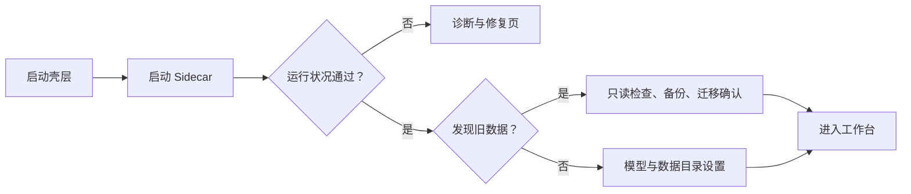
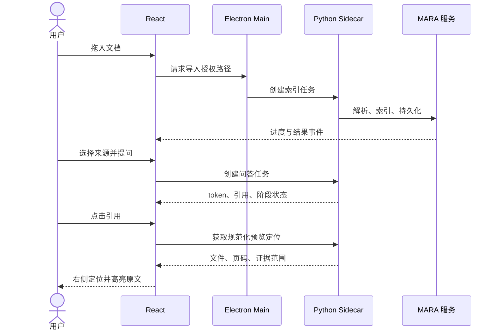

# MARA Desktop 产品需求

## 1. 产品定义

MARA Desktop 是 MARA 的本地优先桌面工作台。它把当前浏览器中的文档研究、
引用核验、页面预览、知识图谱、笔记和 Studio 产物工作流，放进一个安装后
即可使用的 Windows/Linux 应用中，并补齐桌面应用应有的文件、窗口、后台
任务、凭据、更新和故障诊断能力。

它不是代码编辑器，也不是 Codex/Cursor 的功能复刻。Codex 只作为信息架构
参考：左侧导航和历史、中间主工作区、右侧上下文检查器、底部固定输入区。

## 2. 用户与核心任务

### 主要用户

- 研究人员：围绕多个文档进行有引用的问答、比较和报告生成。
- 学生：建立资料库、提问、保存笔记并生成学习材料。
- 技术用户：连接本地或远程模型，检查检索和生成过程，并保留可追溯记录。
- 受限环境用户：希望数据留在本机，且不愿单独安装 Python 或使用命令行。

### 必须顺畅完成的任务

1. 首次启动，选择或确认数据目录，配置模型，完成运行状况检查。
2. 拖入或选择文档，查看索引进度、失败原因并重试。
3. 在一个任务中选择来源，流式提问，停止或重试生成。
4. 点击引用，在右侧直接跳转到对应文件和页面并核验原文。
5. 把答案或选中文本保存为笔记，生成并导出 Studio 产物。
6. 关闭并重新打开应用后，恢复历史任务、来源选择和未完成后台任务状态。
7. 导出诊断包，在不泄露文档内容和密钥的前提下定位安装或运行问题。

## 3. 产品范围

### P0：首个可用版本

- 当前 Web UI 的功能对齐，详见[功能对齐矩阵](feature-parity-matrix.md)。
- 单窗口多面板桌面工作台。
- 本地文件选择、拖放、保存为、在文件管理器中显示。
- 安装包内置 Python Sidecar，用户无需准备开发环境。
- Sidecar 启动、健康检查、崩溃恢复、取消任务和有序关闭。
- 本地持久化、旧数据只读探测、显式迁移和迁移前备份。
- 模型配置、系统凭据存储、离线资源和网络状态提示。
- Windows/Linux 原生安装包、日志和诊断导出。
- 键盘操作、焦点可见、缩放和浅色/深色主题。

### P1：稳定性与效率

- 可恢复的后台索引/生成队列和系统通知。
- 多任务标签、跨任务搜索和命令面板。
- 右侧检查器的可停靠、可调整尺寸和独立弹出预览。
- 增量更新、更新失败回滚、代理和企业网络设置。
- 更细的存储清理、模型缓存和磁盘占用管理。

### 明确不在首版

- macOS、ARM、移动端和浏览器扩展。
- 内置终端、代码仓库代理、Git diff、代码补全或 Cursor/Codex 专属能力。
- 云同步、团队协作、实时多人编辑。
- 任意网页浏览器或加载远程 Web UI。
- 插件市场和不受信任的第三方代码执行。
- 为了视觉相似而改变 MARA 的功能定义或数据语义。

## 4. 关键用户流程

### 首次启动

首次启动不得自动移动、覆盖或升级旧数据。用户取消迁移后仍能进入一个新的、
独立的数据空间。

### 文档研究

## 5. 功能性要求

- 所有长任务必须有唯一任务 ID、进度、取消、错误和可重试状态。
- 流式答案中断后必须保留已产生内容并明确标记“未完成”。
- 引用必须携带稳定来源身份，不能仅靠显示文件名或临时页码关联。
- 删除索引、任务或笔记前必须展示影响范围；涉及源文件时默认只删索引副本。
- 文件系统操作必须经过 Electron Main 的窄接口，Renderer 不直接获得任意路径能力。
- 右侧预览不可执行文档内脚本、宏或活动内容。
- 所有设置必须说明作用域：设备、工作区、任务或当前会话。

## 6. 非功能性要求

| 维度   | 首版要求                                                              |
| ------ | --------------------------------------------------------------------- |
| 平台   | Windows 10/11 x64；Ubuntu 22.04/24.04 x64                             |
| 安装   | 无 Python/Node 前置依赖；普通用户权限可完成安装和首次启动             |
| 启动   | 壳层先显示明确状态；Sidecar 未就绪时不出现无反馈白屏                  |
| 可靠性 | Sidecar 崩溃不带崩 Renderer；可重启，未提交写入使用事务回滚           |
| 安全   | Renderer 沙箱、上下文隔离、无 Node 集成、窄 IPC、仅回环地址和会话令牌 |
| 隐私   | 默认本地；日志不记录文档正文、提示词全文或密钥                        |
| 无障碍 | 核心流程仅键盘可完成；可见焦点；文本对比度至少 4.5:1                  |
| 离线   | UI、帮助、PDF 渲染和基础诊断不依赖 CDN                                |
| 可诊断 | 展示版本、数据路径、Sidecar 状态、路由状态；支持脱敏诊断包            |
| 可维护 | Renderer、桌面边界层和 MARA 领域服务分层；API 有版本与契约测试        |

## 7. 完成定义

首个公开 Beta 只有在以下条件同时满足时才算完成：

- 功能矩阵所有 P0 项均有通过证据，且没有以“打开旧 Web UI”代替实现。
- 四个目标系统完成干净安装、已有数据迁移、升级、卸载和重装测试。
- 安装后断开网络仍可启动、浏览已有任务和预览本地 PDF。
- Windows 安装器有可信签名；Linux 产物有 SHA-256、SBOM 和来源可追踪构建。
- 安全清单、许可证清单、崩溃恢复和数据回滚演练通过。
- `MARA` / `MARA-cli` 与 Web UI 的回归门保持通过。
