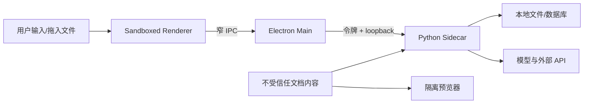

# MARA Desktop 安全与风险登记册

## 1. 信任边界

- Renderer 按“不可信展示层”处理，即使它只加载本地打包代码。
- 文档内容、模型输出、文件名、引用文本和外部链接都按不可信输入处理。
- Electron Main 和 Sidecar 具备高权限，接口必须最小化并验证来源。
- Preview 是内容渲染边界，不执行宏、脚本、嵌入对象或活动链接。

## 2. 强制安全基线

- `nodeIntegration: false`、`contextIsolation: true`、Renderer sandbox 开启。
- Preload 逐方法暴露 API，不暴露 `ipcRenderer`、Electron 或通用 channel。
- 拒绝非预期导航、新窗口和权限请求；外部链接只允许 `https:` 且二次确认。
- 本地 API 只绑定 IPv4 回环随机端口；每次启动使用新令牌；令牌不进入 Renderer。
- 设置严格 CSP；前端资产、图标、字体和 PDF 渲染器全部本地化。
- 文件访问使用 Main 颁发的能力句柄和规范化路径，防止目录穿越与符号链接绕过。
- 日志默认脱敏：不记录密钥、Authorization、文档正文、完整提示词或数据库内容。
- 密钥使用系统安全存储。Linux 检测不到 Secret Service 时只提供会话保存或明确告警，
  不静默退化为明文。
- 发布产物生成 SBOM、许可证清单、SHA-256 和依赖漏洞报告。
- Electron 维持受支持版本，并为高危 Chromium/Electron 漏洞设置紧急更新流程。

## 3. 风险登记

| ID  | 风险/触发信号                                  | 影响                       | 设计处理                                                                            | 放行条件                                  |
| --- | ---------------------------------------------- | -------------------------- | ----------------------------------------------------------------------------------- | ----------------------------------------- |
| R01 | 全量 Python/ML 依赖使包体过大或启动过慢        | 无法下载、安装和更新       | `onedir` 测量；拆可选模型/OCR/VLM；懒加载重模块                                     | Gate 2 记录两平台体积和冷启动，预算经评审 |
| R02 | PyInstaller 隐式导入、原生 DLL/SO 缺失         | 某平台启动或特定格式失败   | 真实服务切片；每平台原生构建；格式 smoke                                            | Win 10/11、Ubuntu 22/24 全部通过          |
| R03 | Windows Defender/杀毒误报 Sidecar              | 安装或启动被拦截           | 稳定文件结构、可信签名、VirusTotal/Defender 预检；失败时仅保留诊断、不上传完整包    | 签名包在干净 VM 安装和启动                |
| R04 | Ubuntu 24 构建依赖新 glibc，22.04 不能运行     | 失去最低平台               | 在 22.04 构建 Linux 产物；两版本测试                                                | 22.04/24.04 安装 smoke                    |
| R05 | Sidecar 端口被猜测或被恶意网页调用             | 本地文件/模型权限泄露      | 回环随机端口、强随机令牌、无 CORS、Renderer 不见凭据                                | 未认证和错误 origin 请求被拒绝            |
| R06 | IPC 暴露任意文件或 shell                       | Electron RCE               | 窄方法、sender 校验、路径能力句柄、禁用通用 invoke                                  | 安全单测和人工威胁复核                    |
| R07 | 旧数据库迁移失败或并发写损坏                   | 用户数据丢失               | 只读探测、备份、staging 迁移、原子切换、回滚                                        | 故障注入迁移演练通过                      |
| R08 | Gradio callback 与领域逻辑耦合                 | Desktop 复制逻辑或行为漂移 | 先加特征测试，再提取 application service                                            | Web/Desktop 契约共同通过                  |
| R09 | 引用身份在新 API 中被简化                      | 引用跳错文件或页面         | 冻结 file/page/element/citation identity；端到端追踪                                | 多文档重名和页码用例通过                  |
| R10 | Office/PPT/表格预览依赖 LibreOffice 或平台组件 | 功能对齐失败               | 打包/检测依赖；明确降级；原文件打开兜底                                             | 格式矩阵和缺依赖提示通过                  |
| R11 | 当前 UI/PDFJS 仍依赖 CDN                       | 离线或受限网络白屏         | 所有前端资源随包分发；CSP 禁止远程代码                                              | 断网 E2E 通过                             |
| R12 | Linux `safeStorage` 无安全后端                 | 密钥明文存储               | 启动检测 backend；会话密钥或阻止持久化                                              | 无 Secret Service 场景测试                |
| R13 | Windows/Linux 更新机制不同                     | 更新失败或版本碎片         | Windows Squirrel/NSIS 更新；Linux 包管理/下载提示；共同版本元数据                   | 升级、失败回滚测试通过                    |
| R14 | 长任务在关闭、崩溃、休眠时丢失                 | 输出丢失、数据库不一致     | 任务 journal、取消/恢复状态、事务、唤醒健康检查                                     | 故障注入和恢复 E2E                        |
| R15 | 模型端点、代理、证书和离线状态复杂             | “应用可开但不能工作”       | 分层 doctor；明确 provider/retriever/VLM 状态；代理设置                             | 常见断网/证书/端点失败可诊断              |
| R16 | npm/Python 供应链或许可证不兼容                | 发布安全/法律风险          | 锁文件、SBOM、漏洞扫描、许可证审查                                                  | 无未处置高危项和禁止许可证                |
| R17 | 自定义窗口框影响 Windows/Linux 可访问性        | 窗口控制不可用             | 首版使用原生标题栏                                                                  | 键盘、缩放、屏幕阅读器 smoke              |
| R18 | 单一 Linux CI 掩盖 Windows 问题                | 发布晚期集中失败           | 从 Gate 2 起保持双平台流水线                                                        | 每个合并请求至少做双平台 build smoke      |
| R19 | Renderer 在 Sidecar healthy 前读取真实数据     | 首屏永久停留在可重试错误   | 查询等待同一 startup Promise；延迟启动回归；并发打包 smoke                          | healthy 后 Doctor/Files/Sessions 自动成功 |
| R20 | OpenAPI 与 TypeScript 响应类型静默漂移         | Main/Renderer 运行时失配   | 从 FastAPI OpenAPI 生成类型；提交生成文件；CI 检查差异                              | 生成漂移门通过                            |
| R21 | 索引任务把源路径泄漏到 Renderer、事件或日志    | 本地身份和目录结构泄漏     | Main 持有选择结果；任务响应仅含文件名；错误脱敏；内部 journal 约束在 Desktop 数据根 | 路径泄漏契约测试和打包 smoke 通过         |
| R22 | 恶意 PDF 字体映射耗尽资源                      | Sidecar 资源耗尽           | PDF 暂不进入 Verified 格式矩阵；详见下文                                            | 资源限制和故障注入通过                    |

R22 当前由 `pypdf 4.2` 的 GHSA-fp3f-mc75-235c 与 GHSA-fwg2-594c-jp42
触发。LlamaIndex 0.10 暂时阻止升级到修复版；后续必须升级 reader 或回移上游资源
限制，完成恶意 PDF 故障注入后才能放行。

## 4. 安全验收场景

1. 修改 Renderer 尝试调用未公开 IPC，必须失败。
2. 从非应用页面、无令牌或错误令牌访问 Sidecar，必须返回 401/403。
3. 拖入包含 `../`、符号链接、超长文件名和恶意 HTML 的文件，不能越权或执行脚本。
4. 预览带 JavaScript 的 PDF/HTML、带宏 Office 文件，不得执行活动内容。
5. 导出诊断包后扫描，不能出现配置密钥、Authorization 或文档正文。
6. Sidecar 在数据库写入中崩溃，重启后数据库一致且任务明确标记。
7. Linux 无 Secret Service 时保存密钥，应用必须阻止或明确要求会话级使用。
8. 断网启动应用，不能加载任何远程脚本、字体或图标。
