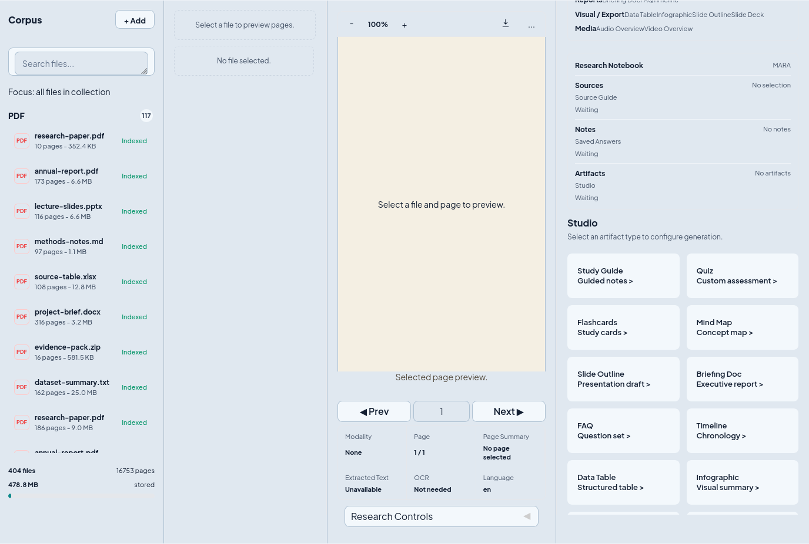

# Basic Usage

## 1. Add your AI models


MARA needs at least one chat model and one embedding model before document QA
can work. The chat model writes answers and planning traces; the embedding model
indexes your documents for retrieval.

To add models in the Web UI:

1. Open the `resources` tab.
2. Add a chat model under the LLM section.
3. Add an embedding model under the embedding section.
4. Set the default model where the UI offers a default toggle.
5. Return to the `chat` tab after both model types are available.

You can also configure models through environment variables or `modelcli.yml`
when running MARA from the command line. This is useful when you want the Web UI,
`MARA docqa`, and `MARA model` to share the same provider setup.

<details markdown>

<summary>Optional model configuration examples</summary>

OpenAI-compatible configuration:

```shell
OPENAI_API_BASE=https://api.openai.com/v1
OPENAI_API_KEY=<your OpenAI API key>
OPENAI_CHAT_MODEL=gpt-4o-mini
OPENAI_EMBEDDINGS_MODEL=text-embedding-3-small
```

Azure OpenAI configuration:

```shell
AZURE_OPENAI_ENDPOINT=<your Azure endpoint>
AZURE_OPENAI_API_KEY=<your Azure API key>
OPENAI_API_VERSION=2024-02-15-preview
AZURE_OPENAI_CHAT_DEPLOYMENT=<your chat deployment>
AZURE_OPENAI_EMBEDDINGS_DEPLOYMENT=<your embedding deployment>
```

Local or self-hosted models can be used through local model settings, Ollama, or
OpenAI-compatible endpoints. Local models are useful when you want document data
to stay on your own machine, but answer quality and speed depend on the model
and available hardware.

Run these checks from the terminal when you want to verify a CLI setup:

```shell
MARA app doctor
MARA docqa doctor
MARA model providers --config modelcli.yml
```

</details>

## 2. Upload and index your sources


Use the `files` tab to add the documents you want MARA to answer from. The
default file index supports common source formats including PDF, Word, PowerPoint,
Excel, CSV, HTML/MHTML, Markdown, text files, images, and ZIP archives.

To index files in the Web UI:

1. Open the `files` tab.
2. Drag files into the upload area or choose them from your file system.
3. Click the upload/index action.
4. Wait for indexing to finish before asking questions about the new sources.
5. Use the file list to confirm source names, refresh the view, or remove files
   you no longer want in the local index.

The same local runtime can be driven from the CLI:

```shell
MARA docqa index ./docs/report.pdf
MARA docqa index ./docs ./archive.zip --reindex
MARA docqa files
```

## 3. Chat with your documents


The `chat` tab is the main workbench. It combines conversation management,
source selection, grounded answers, document preview, evidence review, knowledge
graph context, and Studio artifact controls.

Typical workflow:

1. Choose or create a conversation.
2. Select the source scope:
   - Use all indexed files when you want broad retrieval.
   - Select specific files when the question should stay inside a smaller source
     set.
   - Use page-level or selected-text context when you are inspecting a specific
     passage in the preview panel.
3. Ask a natural-language question.
4. Read the answer with its citations and evidence metadata.
5. Open cited pages or source snippets in the preview area when you need to
   verify a claim.

MARA supports several question scopes:

- Document-level QA for a whole source.
- Page-level QA for one page or slide.
- Multi-document QA across selected files.
- Selected-text QA for a highlighted passage or copied excerpt.
- MARA reasoning mode for more structured planning, retrieval, verification, and
  artifact generation.

## 4. Review evidence, citations, and previews


MARA is designed for answers that can be checked against source evidence. The
right-side panel helps you inspect where an answer came from instead of treating
the model response as a black box.

Use the evidence and preview area to:

- Open cited pages, slides, or document sections.
- Compare answer text with retrieved evidence.
- Inspect page-level context for PDFs and converted Office documents.
- Check whether the answer used the intended source scope.
- Decide whether to ask a follow-up, narrow the source selection, or retry with
  a different reasoning mode.

When an answer abstains or says there is not enough evidence, check that the
source is indexed, selected, and relevant to the question before changing model
settings.

## 5. Explore the knowledge graph and Mind Map


The knowledge graph view helps you move from one question to a broader source
map. It is useful when you are exploring a new paper set, comparing documents,
or looking for follow-up questions.

Use the graph workflow to:

1. Select the sources for the current conversation.
2. Generate or refresh the knowledge graph.
3. Click graph nodes to inspect topics, entities, or relationships.
4. Load a suggested question from the graph into the chat input.
5. Open the fullscreen Mind Map viewer when the graph needs more space.

The graph is part of the same local conversation state used by the Web UI and
`MARA docqa`, so source selection and graph context can be reused across sessions.

## 6. Generate Studio artifacts



Replace `docs/images/mara-studio-artifacts.png` with your own screenshot when
the available artifact types or layout changes.

Studio artifacts turn selected sources and conversation context into reusable
study or research materials. The output should remain grounded in the selected
sources, and the UI should make it clear which sources were used.

Useful artifact types include:

- Study guides.
- Quizzes.
- Flashcards.
- Mind maps.
- Slide outlines.
- Briefing documents.
- FAQs.
- Timelines.
- Custom reports.
- Data tables.

You can also generate and inspect artifacts from the CLI:

```shell
MARA docqa artifacts generate <conversation-id> --type study_guide
MARA docqa artifacts generate <conversation-id> --type quiz
MARA docqa artifacts list <conversation-id>
MARA docqa artifacts show <conversation-id> --artifact <artifact-id>
MARA docqa artifacts export <conversation-id> --artifact <artifact-id> --format md
```

## 7. Continue from the CLI

`MARA docqa` is the command-line companion to the Web UI. It uses the same local
runtime data, so it is useful for repeatable indexing, scripted QA, session
inspection, notes, source selection, and artifact export.

Common commands:

```shell
MARA docqa ask --file report.pdf --prompt "Summarize this document"
MARA docqa ask --file report.pdf --page 12 --prompt "What does this page say?"
MARA docqa ask --file report.pdf --selected-text "contract termination clause" --prompt "Explain this section"
MARA docqa chat --file report.pdf
MARA docqa sessions
MARA docqa resume <conversation-id>
```

Use the top-level `MARA` command for app lifecycle checks, model routing,
platform support assets, deck workflows, workspace file operations, review, and
PDF export.
